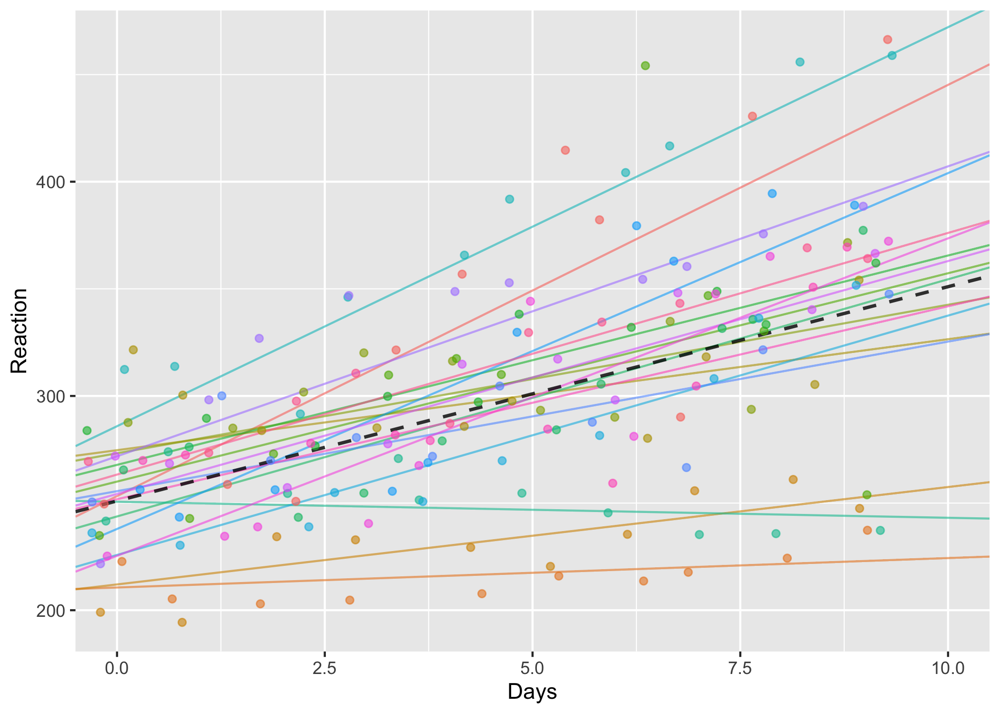

# Random effects {#random-effects}


```{r include=F}
library(tidyverse)
library(webex)
library(pander)
library(lmerTest)
knitr::opts_chunk$set(cache=T, message = F, warning=F, comment="", cache=T)
panderOptions("table.split.table", Inf)
```

### In brief

> In this session we specify more complex random effects, including examples from
> experimental data with multiple sources of variation. We use visualisation techniques
> to explore the concept of 'shrinkage'.


Find the [slides from the session here](slides/random-effects.pptx)


## Sleep (centering)

In the previous session we saw how random intercepts can be used to fit different slopes for different individuals (or groupings) in the data.

The following data show the increased in reaction times over the course of a 10 days experiment in which participants suffered sleep deprivation:


##### {#sleepplot}

```{r, echo=F}
ss = sleepstudy %>% mutate(Subject=as.numeric(as.character(Subject)))
sleep.m1 <- lmer(Reaction ~ Days + (Days | Subject), ss)
ranef(sleep.m1) %>% as_tibble() %>%
  select(grp, term, condval) %>%
  pivot_wider(., names_from=c("term"), values_from="condval") %>%
  transmute(Subject=as.numeric(as.character(grp)), slope=Days+10, inter=`(Intercept)`+251) %>%
  left_join(ss, by="Subject") %>%
  ggplot(aes(x=Days, y=Reaction, color=as.factor(Subject))) +
  geom_abline(aes(intercept=inter, group=Subject, slope=slope, color=as.factor(Subject)), alpha=.6) +
  geom_abline(intercept=251, slope=10, color="black", alpha=.8,size=.8, linetype="dashed") +
  geom_point(alpha=.6, position=position_jitter()) +
  coord_cartesian(xlim=c(0,10)) + guides(color=F)
ggsave("images/sleeprandomslopes.png")
```


:::{.exercise}

- Is there substantial variation between subjects in reaction times on average?
- Is there substantial variation in the effect of sleep deprivation?

`r hide()`

There's certainly variation in the slopes between individuals, and the effect of sleep deprivation does seem to differ markedly between individuals.

However, deciding whether there is variation between people on average is less clear-cut. We need to decide on which day we want to compare the variation. For example, at day 0 there doesn't seem to be much variation. But by day 5 there does, and by day 10 there is a lot.


As we'll see, to estimate this variation from a model we need to be careful about how we include our covariates (e.g. days in this case).


`r unhide()`

:::


#### Centering coefficients

The plot above was based on the following random slopes model:


```{r}
(sleep.m1 <- lmer(Reaction ~ Days + (Days | Subject), ss))
```


If we look at the dataset, we can see that there are 10 rows for each `Subject`, with days indexed from 0 to 9.

```{r}
sleepstudy %>% head(15) %>% pander()
```


As we know from linear regression, when we include parameters thet estimated in such a way that when we look at them individually they are the estimate for an individual row ***if all the other predictors were set to zero***.

In multiple regression this is important because it affects how we interpret the paramaters. When we include multiple predictors it can be hard to read the table of model parameters because we need to add together multiple paramaters to make a prediction. We can get around this using the `predict` function, but the key is that the scale of the

For example, if we use the mtcars data we can see that to estimate a heavy automatic car (high `wt` and `am`=1), we would have to do some arithmetic:

```{r}
lm(mpg~wt*am, data=mtcars)
```

Because weight in this sample ranges from `r min(mtcars$wt)` to `r max(mtcars$wt)`, simply adding the intercpt, `wt` and `am` paramaters would not be an estimate for any car in the sample, because none of them had zero weight.


If, on the other hand, we had ***mean-centered*** `wt` --- that is, subtracted the mean from each value --- then we could interpret the other coefficients as being the prediction when *`wt` was at the average value in the sample*.

```{r}
mt2 <- mtcars %>% mutate(wt = wt - mean(wt))
lm(mpg~wt*am, data=mt2)
```


```{r, include=F, echo=F}
mtcars %>% 
  mutate_if(is.numeric, 
            funs( scale(., scale=F)))
```


By centering the `wt` predictor the other coefficients change (although the model itself is really the same---the amount of variance explained is identical, for instance):


`r hide("Show R squared figures")`

```{r}
# original
broom::glance(lm(mpg~wt*am, data=mtcars)) %>% pull(r.squared)

# centered
broom::glance(lm(mpg~wt*am, data=mt2)) %>% pull(r.squared)
```


`r unhide()`


#### Why centering matters especially for mixed models


In multiple regression centering predictors can be a convenience, but doesn't affect the model fit[^collinfit]. We can always do arithmetic on our coefficients to convert from one configuration to the another when making predictions.

[^collinfit]: This is mostly true. The only exception is when parameters are collinear (see PSYC753 materials); in this case numerical issues when fitting models can lead to small differences, but this is mostly not the case.


***This is not true for mixed models***. How we include predictors changes estimates for our variance paramaters. To see why, consider the example we began with, from the `sleepstudy` data:




If we centered the Days coefficient, the  plot would look like this:

```{r, echo=F}
ss = sleepstudy %>% mutate(Subject=as.numeric(as.character(Subject)), Days.c = Days - mean(Days))
(sleep.m1 <- lmer(Reaction ~ Days + (Days | Subject), ss))
(sleep.m1.c <- lmer(Reaction ~ Days.c + (Days.c | Subject), ss))
ranef(sleep.m1.c) %>% as_tibble() %>%
  select(grp, term, condval) %>%
  pivot_wider(., names_from=c("term"), values_from="condval") %>%
  transmute(Subject=as.numeric(as.character(grp)), slope=Days.c+10, inter=`(Intercept)`+298) %>%
  left_join(ss, by="Subject") %>%
  ggplot(aes(x=Days.c, y=Reaction, color=as.factor(Subject))) +
  geom_abline(aes(intercept=inter, group=Subject, slope=slope, color=as.factor(Subject)), alpha=.3) +
  geom_abline(intercept=298, slope=10, color="black", alpha=.8,size=.8, linetype="dashed") +
  geom_point(alpha=.3, position=position_jitter()) +
  coord_cartesian(xlim=c(-5,5)) + guides(color=F)
ggsave('images/sleeprandom2.png')
```


```{r, echo=F, include=F}
# used for slides
sleep.m1
sleep.m1.c
VarCorr(sleep.m1)
VarCorr(sleep.m1.c)
```


Nothing has changed, *except the scale of the x axis*. The x axis is now `Days.c` which ranges from -5 to 5, and 0 is in the middle; previously `Days` ranged from 0 to 9, with 5 as the midpoint.

BUT this small change is important because our paramaters are estimates when all the *other* predictors = zero.

This means that when we use the centered predictor our random intercept variance --- the variation between people --- is estimated for the midpoint of the study, because day 5 is coded as zero in `Days.c`.

We can see the effect on the variance paramaters if we compare the output of VarCorr. First uncentered:

```{r, message=F, warning=F}
VarCorr(sleep.m1)
```

And then centered:

```{r, message=F, warning=F}
VarCorr(sleep.m1.c)
```

When we centre `Days` then the proportion of variance attributed to subjects changes from about 80% to over 86%.


-----------------------------


This plot simplifies and shows the difference between models with centered and uncentered predictors. The vertical dashed lines show where the variance for the random intercept would be taken from in each case:

```{r, echo=F}
df <- tibble(intercept = rnorm(20, 5,.5), slope=rnorm(20, 0,.3), i=1:20)

df %>%
  ggplot() +
  geom_abline(aes(intercept=intercept, group=i, slope=slope ), alpha=.5) +
  coord_cartesian(xlim=c(0,10), ylim=c(0,10)) +
  geom_hline(yintercept=0) +
  geom_hline(yintercept=5, color="red")  +
  geom_vline(xintercept=0, linetype="dashed") + geom_vline(xintercept=5, linetype="dashed") +
  geom_text(aes(x=0.1, y=9.9), hjust=0, label="Intercept variance taken here \n(Uncentered)") +
  geom_text(aes(x=5.1, y=9.9), hjust=0, label="Centered\n") + ylab("Outcome") + xlab("Predictor")

ggsave("images/mean-centre-mixed.png")
```


#### What's the right thing to do?

It depends on what your question is!

In the `sleepstudy` example we might argue that the first (uncentered) model makes more sense because there is a definite start to the experiment: At Day 0 we have people in their 'natural' state, before we deprive them of sleep. So in this model the `(Intercept)` term describes the varation between people in the normal state.

However in other cases this wouldn't be true. For example, let's say we used the Scottish schools data and included the `year` each cohort was taken in as a predictor:

```{r, echo=F, include=F}
schools <- read_csv('data/cmm/5.1.txt') %>% mutate(year=cohort90+1990)
```


```{r}
schools.1 <- lmer(score ~ year + (year|schoolid), data=schools)
VarCorr(schools.1)                  
```

Now, the between-school variance is estimated in the year 0 (i.e. >2000 years ago), which clearly doesn't make much sense. If we compare the ICC (or % variance-attributable) within and between schools it makes a huge difference:

```{r}
schools.2 <- lmer(score ~ cohort90 + (cohort90|schoolid), data=schools)

bind_rows(
  VarCorr(schools.1) %>% as.tibble() %>% mutate(Centered="No"),
  VarCorr(schools.2) %>% as.tibble() %>% mutate(Centered="Yes")) %>%
  filter(is.na(var2)) %>%
  group_by(Centered) %>%
  mutate(icc=round(vcov / sum(vcov) * 100, 2)) %>%
  select(grp, var1, icc) %>%
  rename(Grouping=grp, Parameter=var1, `%`=icc) %>%
  pander()
```

In this case it makes no sense to estimate the variance when `year` = 0 and we should definitely center the variables.


**If you're not sure, however, it's probably safer to center predictors in mixed models.**


:::{.exercise}

Return to the piglets example from sessions 1 and 2.

- Refit the model with centered predictors
- Calculate the variance partition by differences between piglets using centered and uncentered models. What differences do you spot?
- Which parameterisation most sense in this case? Are we more interested in variation between pigs at the start or the middle of the study?

:::


## MMA

](images/mma.jpg)


```{r, echo=F, include=F}
# setting up data exported from jamovi
# NOTE the csv file provided on plos one is corrupted. You must open the jamovi file and export from there to rds

mma.wide <- read_rds('data/mma/mma.rds') %>%
  mutate(person = row_number()) %>%
  rename(FI = `Wingate_fatigue index [%]`) %>%
  mutate(FI.c = FI - mean(FI))

# see stats section in paper
prerowstodrop <- mma.wide %>% select(starts_with('RT_before_')) %>% complete.cases()
postrowstodrop <- mma.wide %>% select(starts_with('RT_after_')) %>% complete.cases()
sum(!prerowstodrop)
sum(!postrowstodrop)

mma.repeated <- mma.wide %>%
  select(person, matches('RT_|MT_')) %>%
  pivot_longer(-person, names_to=c("outcome", "condition", "trial"), names_sep="_")

mma <- mma.repeated %>%
  pivot_wider(id_cols=c("person", "condition", "trial"), names_from=outcome, values_from=value) %>%
  left_join(., mma.wide %>% select(person, FI, FI.c)) %>%
  mutate(stimulus = as.numeric(trial)) %>%
  mutate(condition=fct_rev(condition)) %>%
  # filter(trial>4) %>%
  # centering, see syntax file here: https://journals.plos.org/plosone/article/file?id=10.1371/journal.pone.0227675.s005&type=supplementary
  mutate(stimulus.c = stimulus - mean(stimulus))

#xtabs(~condition+condition_12, data=mma)

rowstokeep <- mma %>% select(trial,RT,MT,FI) %>% complete.cases()

mma.raw <- mma %>%
  mutate(included=rowstokeep) %>%
  mutate(included = ifelse(stimulus < 5, FALSE, included))

mma.raw %>% select(person, condition, RT, FI, stimulus, included) %>%
  write_csv('data/mma_bw.csv')

read_csv('data/mma_bw.csv') %>% filter(included==TRUE)
```


The following data are a tidied-up version of the data made available by the authors of the MMA paper we discussed in class [@pavelka2020acute]. The `included` column tells whether the row was included in the authors' analysis from the paper. By filtering out non-included rows we can make our results match exactly.

```{r}
mma  <- read_csv('data/mma_bw.csv') %>% filter(included==TRUE)
```


:::{.exercise}

- Import the tidied the data (from [this file](data/mma_bw.csv))

- Fit the model described in the paper (in their supplement the authors reveal that `stimulus` and `FI` were mean-centered).

`r hide("How do I mean-centre things?")`

```{r}
mma.c <- mma %>%
  mutate(FI.c = FI - mean(FI), stimulus.c = stimulus - mean(stimulus))
mma.c %>% head
```

`r unhide()`


`r hide("Show the model")`

```{r}
(mma.m1 <- lmer(RT ~ 1 + condition + stimulus.c + FI.c + condition:stimulus.c + (1|person), data=mma.c))
```

`r unhide()`


- Look at the effect of `condition` in your model. Does this match the authors' report that "POST RTs were found significantly higher than PRE (mean difference = 4.031 ms, SE = 1.726"?

`r hide("Show answer")`

Yes: the `conditionbefore` coefficient from your model should have been -4.03 also. The direction is reversed because the authors' encoded their model slightly differently (their parameter would have been called `conditionafter`) but the meaning is the same.

To see the SE, use `summary` and `coef` together:

```{r}
summary(mma.m1) %>% coef() %>% pander()
```


This is 0.17660, which is what the authors report.


`r unhide()`


- Are the reported findings robust to minor changes in the model fitting? For example, if parameters are removed or if the excluded data is incorporated?

`r hide("Show details")`


This model, excluding fatigue (`FI`), predicts the same 4ms difference:

```{r}
mma.m2 <- lmer(RT ~ 1 + condition * stimulus.c + (stimulus.c|person), data=mma.c)
summary(mma.m2) %>% coef() %>% pander()
```

However this model fit includes all the excluded data and predicts a 2ms difference in the other direction, and is not statistically significant:

```{r}
mma.all  <- read_csv('data/mma_bw.csv') %>%
  mutate(stimulus.c = stimulus-mean(stimulus), FI.c = FI-mean(FI), )
mma.m3 <- lmer(RT ~ 1 + condition + stimulus.c + FI.c + condition:stimulus.c +  (1 | person), data=mma.all)
mma.m3 %>% summary() %>% coef() %>% pander()
```


`r unhide()`


- How should we interpret these findings, based on the replications you have made?


:::


## Politeness

Winter & Grawunder, 2012 describe a study of the pitch (frequency) of individuals' speech when they recorded different phrases (scenarios). The scenarios differed in whether they required 'politeness' or were more informal in nature. A reduced version of this dataset is also described and analysed in a mixed-models tutorial (see http://www.bodowinter.com/uploads/1/2/9/3/129362560/bw_lme_tutorial2.pdf).

The data are available online and can be read from this URL:


```{r}
# this previously taken from http://www.bodowinter.com/tutorial/politeness_data.csv but that link is now broken
politeness <-  read_csv("https://raw.githubusercontent.com/opetchey/BIO144/master/3_datasets/politeness_data.csv")
```


:::{.exercise}

1. Make a plot showing how average levels of frequency differs *between individuals*.


`r hide("Show me the plot")`

```{r}
politeness %>%
  ggplot(aes(subject, frequency)) + geom_boxplot()
```

`r unhide()`


2. Make a plot showing how frequency differs *between scenarios*


`r hide("Show me the plot")`

```{r}
politeness %>%
  ggplot(aes(factor(scenario), frequency)) + geom_boxplot()
```

`r unhide()`


3. Based on the plots, which do you think accounts for more variation in frequency: `subject` or `scenario`?


`r hide("Show answer")`

It looks like subjects vary more in frequency than do scenarios, but there appears to be variation attributable to both variables.

`r unhide()`


4. Fit a random intercepts model to the data, allowing for variation between subjects. Include fixed effects for `attitude` and `gender`:

`r hide('Show me that model')`

```{r}
(polite.ri.subject <- lmer(frequency ~ attitude + gender + (1|subject), data=politeness))
```


`r unhide()`


`r hide("What other commands should I run to interpret the model at this point?")`
You might then also want to look at the regression coefficients, Anova table, and tests of random effects:

```{r}
# regression coefficients
polite.ri.subject %>% summary %>% coef() %>% pander(caption="Model coefficients")

# anova-table
anova(polite.ri.subject) %>% pander(caption="Anova table")

# tests of random effects
ranova(polite.ri.subject) %>% pander(caption="Test of random intercepts")
```


`r unhide()`


4. Fit a second random intercepts model, allowing for variation in both subjects and between the different scenarios.

`r hide("Show me that model")`

```{r}
polite.ri.both <- lmer(frequency ~ attitude + gender +
                         (1|subject) + (1|scenario), data=politeness)

# test of random effect
ranova(polite.ri.both)
```

`r unhide()`


5. How much variance was attributable to subjects or scenarios, compared with the total variance?

`r hide("Show me how to calculate this")`

Remember to convert the `VarCorr` output to a dataframe to see the variance (rather than standard deviations) in the `vcov` column. You can then use `mutate` or `transmute` to calculate the within/betwen ratio (the ICC).

```{r}
polite.ri.both %>% VarCorr() %>% as_tibble() %>%
  transmute(
    Term=Hmisc::capitalize(grp),
    `% variation`=round(vcov / sum(vcov) * 100, 1)
  ) %>%
  pander()
```

`r unhide()`


6. Add random slopes to the model above. Allow the effect of `attitude` (whether the scenario was polite or informal) to differ between subjects, and also to differ between the different example scenarios sampled in this study.


`r hide("Show me that model formula")`

```{r}
frequency ~ attitude + gender + (attitude|subject) + (attitude|scenario)
```

`r unhide()`


7. Use `ranova` to test whether the random slopes improved the model


`r hide("Show me how")`

First run the model:

```{r}
polite.rslopes <- lmer(frequency ~ attitude + gender + (attitude|subject) +
                         (attitude|scenario), data=politeness)
```


:::{.tip}

If you see a message saying `boundary (singular) fit: see ?isSingular` don't worry for now. This IS actually quite important, but we will discuss it in more detail in the next session.

:::


And then use `ranova`:

```{r}
ranova(polite.rslopes)
```

Both of the `Pr(>Chisq)` values (the *p* values for the chi squared test) are non-significant.

You might also note this more complex model had some problems fitting: Don't worry for now, but we will cover with this in the final session.


`r unhide()`


7. If a random slopes model is not 'significantly' better than a similar model which does not include the random slope term, is there any reason why we  might still prefer it, and use the 'full' model to base our inference on?


`r hide("Show answer")`

Yes - simulation studies, including Barr et al 2013 suggest that a 'maximal' model is likely to be more conservative than a model which excludes non-significant random effects terms.

`r unhide()`


8. How might mixed models make the problem of 'researcher degrees of freedom' worse? What effect might this have? How can it be avoided?

`r hide("Show answer")`

Mixed models provide many more possible 'ways to do it'. In addition to different fixed-effects specifications we can now also have many different random effects specifications. This increases degrees of freedom in the analysis, and makes it even more important to pre-specify analyses.

`r unhide()`


:::


## Anova in mixed models

The file [journal.pone.0226387.s001.sav](data/journal.pone.0226387.s001.sav) contains data from @kemps2019cognitive.
These have been reshaped to long format and tidied up in [data/drinks.csv](data/drinks.csv).

The study explored the effect of an cognitive bias modification intervention, and one of the outcomes was Attentional Bias in a dot-probe task.

There were two experimental conditions (between subjects) and participants were tested twice. The original paper reported results from a mixed model in which `Time` was a repeated/within-subjects factor.

```{r echo=F, include=F}
drinks_ <- haven::read_sav('data/journal.pone.0226387.s001.sav') %>%
  mutate_if(~class(.)=="haven_labelled", funs(as_factor))
# drinks_ %>% glimpse

longtmp <- drinks_ %>%
  select(ParticipantID, Att_bias_pre_training, Att_bias_post_training) %>%
  pivot_longer(-ParticipantID, names_pattern = "Att_bias_(pre|post)_training")
class(drinks_$Gender)
drinks <- left_join(longtmp, drinks_, by="ParticipantID") %>%
  select(Participant=ParticipantID, Condition, Age, Gender, Time=name, AttBias=value) %>%
  mutate(Time=Hmisc::capitalize(Time))
drinks %>% write_csv('data/drinks.csv')
drinks  <-  read_csv('data/drinks.csv')
```

```{r}
drinks %>% head %>% pander("6 rows from the `drinks` dataset")
```


Plotting the data indicates a Time*Condition interaction:

```{r, echo=F}
drinks %>%
  ggplot(aes(fct_rev(Time), AttBias, color=factor(Condition),
             group=factor(Condition))) +
  stat_summary(fun.data=mean_se, position=position_dodge(width=.1)) +
  stat_summary(geom="line", fun.data=mean_se, position=position_dodge(width=.1)) +
  xlab("Time") + ylab("Attentional Bias (ms change)") + scale_color_discrete("Condition")

ggsave("images/drinksplot.png", width=4, height=3)
```


:::{.exercise}

1. Run a random intercepts model which would test the relationships shown in the plot above

`r hide("Solution")`

```{r}
(drinks.m1 <- lmer(AttBias ~ Condition * Time + (1|Participant), data=drinks))
```

`r unhide()`


2. Use the `anova` command to test the interaction of Condition and Time


`r hide("Solution")`

```{r}
drinks.m1 %>% anova
```

There does appear to be an interaction.

`r unhide()`


:::


### Follow-up tests

To run follow-up tests comparing individual cells in the design we can use another R package called `emmeans`.


```{r}
library(emmeans)
```


The `emmeans` function (which is inside the `emmeans` package we just loaded), can calculate means and confidence intervals for each cell in the design:

```{r}
emmeans(drinks.m1, ~Condition*Time)
```

In the code above we used the `emmeans` function, and gave it the saved random intercept model as input. In the second input (where is says `~Condition*Time`) we are using a formula to describe which part of the design we would like means for.

Helpfully, you can also plot the results of this function, so the folliwing is a shortcut for writing a ggplot command yourself:

```{r}
plot(emmeans(drinks.m1, ~Condition*Time)) + xlab("Predicted value")
```


We can also save the results of `emmeans` and send it to the `contrast` function. This produces t tests for each pairwise comparison:

```{r}
savedmeans1 <- emmeans(drinks.m1, ~Condition*Time)
contrast(savedmeans1, method='pairwise', adjust='none')
```

And we can add `adjust="bonferonni"` or `adjust="tukey"` method to adjust for multiple comparisons

```{r}
contrast(savedmeans1, method='pairwise', adjust='tukey')
```


If we want to compare pairs of groups, we can adjust the formula we pass to the `emmeans` function. In the example below I compare Conditions averaged across both time periods:

```{r echo=F, include=F}
emmeans(drinks.m1, ~Condition)
```


```{r}
savedmeans2 <- emmeans(drinks.m1, ~Condition)
contrast(savedmeans2, method='pairwise')
```

In this example we compare the Pre and Post measurement times *within* each group (here the bar symbol, `|`, is read as 'within'):

```{r}
savedmeans3 <- emmeans(drinks.m1, ~Time|Condition)
contrast(savedmeans3, method='pairwise')
```


:::{.tip}

##### Useful `emmeans` examples


```{r, echo=T, eval=F}
# get the means of all combinations of factors A and B
emmeans(model, ~A+B)

# menas the same as the line above
emmeans(model, ~A*B)

# show all pairwise contrasts for all combinations of A and B
contrast(emmeans(model, pairwise~A+B), pairwise)

# show tests of the effect of A within each level of B
contrast(emmeans(model, pairwise~A|B), pairwise)

# show the confidence interval for the tests above:
confint(contrast(emmeans(model, pairwise~A|B), pairwise))

```

:::


:::{.exercise}

- Adjust the code using `emmeans` and `contrast` above to compare Pre vs Post scores (averaged across Condition)
- Compare the conditions *within* each time period.

`r hide("Solution")`

```{r}
# compare times averaged across conditions
contrast(emmeans(drinks.m1, ~Time), method='pairwise')
# compare conditions within each time
contrast(emmeans(drinks.m1, ~Condition|Time), method='pairwise')
```


`r unhide()`
:::


## Further reading

https://besjournals.onlinelibrary.wiley.com/doi/full/10.1111/j.2041-210x.2012.00261.x

Meteyard summarises current good practice in running and reporting mixed models [@meteyard2020best].

Barr et al (-@barr2013random) go into more detail on why mixed models are preferable to RM anova, and this paper will be a useful reference for future sessions too:  [Barr, D. J., Levy, R., Scheepers, C., & Tily, H. J. (2013). Random effects structure for confirmatory hypothesis testing: Keep it maximal. Journal of memory and language, 68(3), 255-278.](http://eprints.gla.ac.uk/79067/)

This paper expands on the original 'keep it maximal' paper, covering situations with interactions between within factors: [Barr, D. J. (2013). Random effects structure for testing interactions in linear mixed-effects models. Frontiers in psychology, 4, 328.](http://eprints.gla.ac.uk/88175/)

See also: [Eager, C., & Roy, J. (2017). Mixed effects models are sometimes terrible. arXiv preprint arXiv:1701.04858.](https://arxiv.org/abs/1701.04858)
