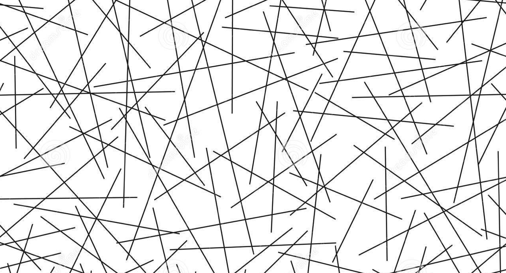

# Random effects {#random-effects}



```{r include=F}
library(tidyverse)
library(webex)
library(pander)
library(lmerTest)
knitr::opts_chunk$set(cache=T, message=F, warning=F)
```

### In brief

> In this session we specify more complex random effects, including examples from
> experimental data with multiple sources of variation. We use visualisation techniques
> to explore the concept of 'shrinkage'.


## Politeness 

Winter & Grawunder, 2012 describe a study of the pitch (frequency) of individuals' speech when they recorded different phrases (scenarios). The scenarios differed in whether they required 'politeness' or were more informal in nature. A reduced version of this dataset is also described and analysed in a mixed-models tutorial (see http://www.bodowinter.com/tutorial/bw_LME_tutorial2.pdf).

The data are available online and can be read from this URL:


```{r}
# this previously taken from http://www.bodowinter.com/tutorial/politeness_data.csv but that link now a 404
politeness <-  read_csv("https://raw.githubusercontent.com/opetchey/BIO144/master/3_datasets/politeness_data.csv")
```


:::{.exercise}

1. Make a plot showing how average levels of frequency differs between individuals.


`r hide("Show me the plot")`

```{r}
politeness %>%
  ggplot(aes(subject, frequency)) + geom_boxplot()
```

You could also use `stat_summary()` instead of `geom_boxplot()` to get a point range plot.

`r unhide()`


2. Make a plot showing how frequency differs between scenarios


`r hide("Show me the plot")`

```{r}
politeness %>%
  ggplot(aes(factor(scenario), frequency)) + geom_boxplot()
```

`r unhide()`


3. Based on the plots, which do you think accounts for more variation in frequency: `subject` or `scenario`?


`r hide("Show answer")`

It looks like subjects vary more in frequency than do scenarios, but there appears to be variation attributable to both variables.

`r unhide()`


4. Fit a random intercepts model to the data, allowing for variation between subjects.

`r hide('Show me that model')`

```{r}

(polite.ri.subject <- lmer(frequency ~ attitude + (1|subject), data=politeness))

```


`r unhide()`


`r hide("What other commands should I run to interpret the model?")`
You might then also want to look at the regression coefficients, Anova table, and tests of random effects:

```{r}
# regression coefficients
polite.ri.subject %>% summary %>% coef()

# anova-table
anova(polite.ri.subject)

# tests of random effects
ranova(polite.ri.subject)
```


`r unhide()`


4. Fit a second random intercepts model, allowing for variation in both subjects and between the different scenarios. Use to `VarCorr` function to estimate how much variation (what percentage of the total) was between subjects, and what percentage was between scenarios.

`r hide("Show me that model")`

```{r}
polite.ri.both <- lmer(frequency ~ attitude + 
                         (1|subject) + (1|scenario), data=politeness)
ranova(polite.ri.both)
```

`r unhide()`


5. How much variance was attributable to subjects or scenarios, compared with the total variance?

`r hide("Show ne how to calculate this")`

Remember to convert the `VarCorr` output to a dataframe to see the variance (rather than standard deviations) in the `vcov` column. You can then use `mutate` to calculate the within/betwen ratio (the ICC).

```{r}
VarCorr(polite.ri.both) %>%  
  as.tibble() %>% 
  select(grp, vcov) %>% 
  mutate(icc = vcov /  sum(vcov)) %>% 
  pander()
```

```{r, include=F, echo=F}
iccsraw <- VarCorr(polite.ri.both) %>%  
  as.tibble() %>% 
  select(grp, vcov) %>% 
  mutate(icc = vcov /  sum(vcov)) %>% pull(icc) 

iccs <- iccsraw %>% round(2)
```


`r unhide()`


6. Add random slopes to the model above. Allow the effect of `attitude` (whether the scenario was polite or informal) to differ between subjects, and also to differ between the different example scenarios sampled in this study.


`r hide("Show me that model formula")`

```{r}
frequency ~ attitude + (attitude|subject) + (attitude|scenario)
```

`r unhide()`


7. Use `ranova` to test whether the random slopes were significant predictors of variance in `frequency`.


`r hide("Show me how")`

First run the model:

```{r}
polite.rslopes <- lmer(frequency ~ attitude + (attitude|subject) +
                         (attitude|scenario), data=politeness)
```


:::{.tip}

If you see a message saying `boundary (singular) fit: see ?isSingular` don't worry for now. This IS actually quite important, but we will discuss it in more detail in the next session.

:::


And then use `ranova`:

```{r}
ranova(polite.rslopes)
```

Both of the `Pr(>Chisq)` values (the *p* values for the chi squared test) are non-significant.

`r unhide()`


7. Use `anova` to test the same thing: whether adding the random slope for `attitude` within `scenario` or `subject` improved the model.


`r hide("Show me how")`

First run two models, with and without the random slope you want to test:

```{r}
model.without <- lmer(frequency ~ attitude + 
                         (1|subject) +
                         (attitude|scenario), data=politeness)


model.with <- lmer(frequency ~ attitude + 
                         (attitude|subject) +
                         (attitude|scenario), data=politeness)

```

And then use `anova`:

```{r}
anova(model.with, model.without)
```

You should notice that the  *p* value for the test has the same number of degrees of freedom, and the same value (very slightly different due to rounding errors).

The `Pr(>Chisq)` is again non-significant, indicating that the random slope within `subject` doesn't explain additional variance.

`r unhide()`


8. If a random slopes model is not 'significantly' better than a similar model which does not include the random slope term, is there any reason why we  might still prefer it, and use the 'full' model to base our inference on?


`r hide("Show answer")`

Yes - simulation studies, including Barr et al 2013 suggest that a 'maximal' model is likely to be more conservative than a model which excludes non-significant random effects terms.

`r unhide()`


9. How might mixed models make the problem of 'researcher degrees of freedom' worse? What effect might this have? How can it be avoided?

`r hide("Show answer")`

Mixed models provide many more possible 'ways to do it'. In addition to different fixed-effects specifications we can now also have many different random effects specifications. This increases degrees of freedom in the analysis, and makes it even more important to pre-specify analyses.

`r unhide()`


:::


<!---

```{r}
polite.ri1 <- lmer(frequency ~ attitude + (1|subject), data=politeness)
summary(polite.ri1)
ranova(polite.ri1)
```

```{r}
polite.ri <- lmer(frequency ~ attitude + (1|subject) + (1|scenario), data=politeness)
summary(polite.ri)
VarCorr(polite.ri)
ranova(polite.ri)
```


```{r}
politeness.agg <- politeness %>% 
  group_by(subject, attitude) %>% 
  summarise(frequency = mean(frequency))
  
polite.ri.agg <- lmer(frequency ~ attitude + (1|subject), data=politeness)
polite.ri %>% summary %>%  coefficients
polite.ri.agg %>% summary %>%  coefficients
```


```{r}
polite.rs <- lmer(frequency ~ attitude + 
                    (attitude|subject) + 
                    (attitude|scenario), data=politeness)
polite.rs %>% summary %>%  coefficients
polite.rs %>% ranova
```


```{r}
anova(polite.ri, polite.rs)
```


-->


## Further reading


https://besjournals.onlinelibrary.wiley.com/doi/full/10.1111/j.2041-210x.2012.00261.x


Barr et al go into more detail on why mixed models are preferable to RM anova, and this paper will be a useful reference for future sessions too:  [Barr, D. J., Levy, R., Scheepers, C., & Tily, H. J. (2013). Random effects structure for confirmatory hypothesis testing: Keep it maximal. Journal of memory and language, 68(3), 255-278.](http://eprints.gla.ac.uk/79067/)

This paper expands on the original 'keep it maximal' paper, covering situations with interactions between within factors: [Barr, D. J. (2013). Random effects structure for testing interactions in linear mixed-effects models. Frontiers in psychology, 4, 328.](http://eprints.gla.ac.uk/88175/)

See also: [Eager, C., & Roy, J. (2017). Mixed effects models are sometimes terrible. arXiv preprint arXiv:1701.04858.](https://arxiv.org/abs/1701.04858)


