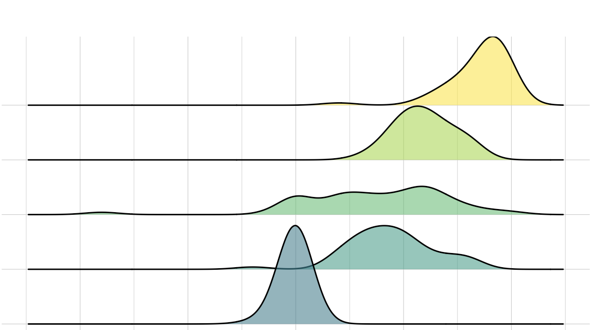

# Bayesian estimation {#bayesian-estimation}

```{r include=F,echo=F}
library(tidyverse)
library(webex)
library(cowplot)
library(DiagrammeR)
source('grvizpng.R')
theme_set(theme_minimal())
```



#### In brief

> XXX
