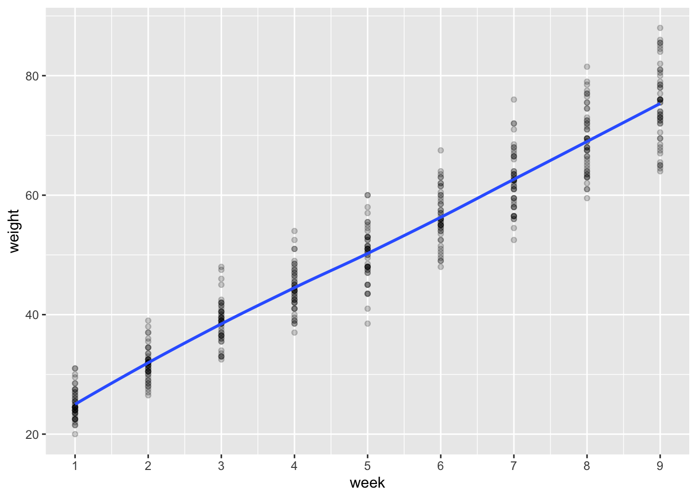

# Mixed models {#mixed-models}


### In brief.

> In this session we introduce model formulas for mixed models and specify random
> intercepts and random slopes models. We also introduce the likelihood ratio test, and
> significance tests for random effects parameters.


Slides for today are here: [mixed-models.pptx](slides/mixed-models.pptx)


## Piglets (random intercepts) {#piglets-random-slope}


You can load the piglet data from this URL:


```r
pigs <- read_csv('http://bit.ly/psystats-pigs')
pigs %>% glimpse
```

```
## Observations: 432
## Variables: 3
## $ id     <dbl> 1, 1, 1, 1, 1, 1, 1, 1, 1, 2, 2, 2, 2, 2, 2, 2, 2, 2, 3, 3, 3,…
## $ week   <dbl> 1, 2, 3, 4, 5, 6, 7, 8, 9, 1, 2, 3, 4, 5, 6, 7, 8, 9, 1, 2, 3,…
## $ weight <dbl> 24.0, 32.0, 39.0, 42.5, 48.0, 54.5, 61.0, 65.0, 72.0, 22.5, 30…
```


The data are from a study of piglet weights, in the 9 weeks after they are weaned. There are multiple piglets (identified by the `id` variable). Weights are in kg.


:::{.exercise}


0. Load the `lmerTest` package, and `tidyverse`, before you begin.


<div class='solution'><button class='solution-button'>How?</button>


```r
library(lmerTest)
library(tidyverse)
```


</div>


1. Draw a smoothed line plot showing the average increase in weight over the weeks.


<div class='solution'><button class='solution-button'>Show me what that might look like</button>




Note that I set `geom_point(alpha=.2)` to reduce the weight of the points plotted, and make the blue smoothed line more prominent.


</div>


:::


:::{.exercise}


- Fit a random intercepts model where piglet weights are predicted by `week`.


<div class='solution'><button class='solution-button'>Remind me how</button>


```r
pigs.ri <- lmer(weight ~ week + (1|id), data=pigs)
summary(pigs.ri)
```

```
## Linear mixed model fit by REML. t-tests use Satterthwaite's method [
## lmerModLmerTest]
## Formula: weight ~ week + (1 | id)
##    Data: pigs
## 
## REML criterion at convergence: 2033.8
## 
## Scaled residuals: 
##     Min      1Q  Median      3Q     Max 
## -3.7390 -0.5456  0.0184  0.5122  3.9313 
## 
## Random effects:
##  Groups   Name        Variance Std.Dev.
##  id       (Intercept) 15.142   3.891   
##  Residual              4.395   2.096   
## Number of obs: 432, groups:  id, 48
## 
## Fixed effects:
##              Estimate Std. Error        df t value Pr(>|t|)    
## (Intercept)  19.35561    0.60314  58.55889   32.09   <2e-16 ***
## week          6.20990    0.03906 383.00000  158.97   <2e-16 ***
## ---
## Signif. codes:  0 '***' 0.001 '**' 0.01 '*' 0.05 '.' 0.1 ' ' 1
## 
## Correlation of Fixed Effects:
##      (Intr)
## week -0.324
```


</div>


- Based on the model, what weight do the piglets start at?
- Based on the model, how fast are the piglets growing?


<div class='solution'><button class='solution-button'>Show answers</button>


The coefficients table has the information we need:


```r
pigs.ri %>% fixef()
```

```
## (Intercept)        week 
##   19.355613    6.209896
```


The pigs start at an average of 19.36 + pigres[2]` = `sum(pigres)`kg, and increase by 6.21 each week.

This corresponds fairly closely to averages calculated from the raw data:


```r
pigs %>% 
  filter(week %in% c(1,9)) %>% 
  group_by(week) %>% 
  summarise(mean(weight)) %>% 
  pander()
```


---------------------
 week   mean(weight) 
------ --------------
  1        25.02     

  9        75.22     
---------------------


</div>


:::


## $R^2$ for mixed models

In the session I mentioned $R^2$ for mixed models. To calculate this you need to use the `MuMIn::r.squaredGLMM` function.

The literature underpinning the calculations is fairly complex [see @nakagawa2013general and @johnson2014extension] but the key idea is that we now have two different $R^2$ values:

- The *marginal* $R^2$, which is the variance explained by the fixed effects (this is most similar to conventional $R^2$ from a linear model)

- The *conditional* $R^2$, which is the variance explained by both the fixed effects, *and* the random effects.


:::{.exercise}

1. Using the random intercepts model you ran in the previous section  (where piglet weights were predicted by time), use the `MuMIn::r.squaredGLMM` function to calculate the marginal and conditional $R^2$.

2. How much variance is explained by the `week` variable? How much extra variance can we explain by including the random intercepts?


<div class='solution'><button class='solution-button'>Show me the code</button>


```r
library(MuMIn)
pigs.ri <- lmer(weight ~ week + (1|id), data=pigs)
r.squaredGLMM(pigs.ri) %>% round(2) %>%  pander()
```


-------------
 R2m    R2c  
------ ------
 0.93   0.98 
-------------

`R2m` refers to the marginal $R^2$, `R2c` refers to the conditional value.

This means that, without the random intercepts, we could explain about 93% of the variance. With random intercepts we can explain over 98%.


</div>


:::


## Random slopes


In the session we discussed how to add additional 'random slope' terms. That is, terms which allow the effect of predictors to vary between individuals (or other groupings in the data).

We did this by adding variables within the parentheses which describe the 'random' part of the model. For example, a formula might be:


```r
outcome ~ predictor + (predictor | grouping)
```

Here we allow the slope for `predictor` to vary for different levels of `grouping`.


More concretely, we might have formulae like this, which allows the `income` of different individuals to grow at different rates over `time`:


```r
income ~ time + (time | person)
```


Or this one, where the effect of `intervention` are allowed to vary between different schools:


```r
reading_age ~ intervention + (intervention | school)
```


:::{.exercise}


1. Fit a new model, which allows the piglets to grow at different rates over the weeks of the study.


<div class='solution'><button class='solution-button'>Show me how</button>


```r
# here pigs.rs stands for 'random slopes'
pigs.rs <- lmer(weight ~ week + (week|id), data=pigs)
```

Note: if you get a warning about 'model failed to converge' don't worry for now. This IS important, but we will discuss in the next session.


</div>


1. Compare the *average* slope for `week` between this random slopes model, and the random intercepts model you ran before.


<div class='solution'><button class='solution-button'>Show me how</button>


```r
pigs.ri %>% fixef %>% round(2)
```

```
## (Intercept)        week 
##       19.36        6.21
```

```r
pigs.rs %>% fixef %>% round(2)
```

```
## (Intercept)        week 
##       19.36        6.21
```

This code shows only the regression parameters (the fixed effects) for the two models. There's no difference between them in this case (although that wouldn't _always_ be true).

That doesn't mean that including random slopes isn't worthwhile though — even though the slope doesn't change, the confidence interval for it does (it is a little bit wider):


```r
pigs.ri %>% confint()
```

```
##                 2.5 %    97.5 %
## .sig01       3.167027  4.796661
## .sigma       1.953849  2.250896
## (Intercept) 18.165548 20.545679
## week         6.133241  6.286550
```

```r
pigs.rs %>% confint()
```

```
##                  2.5 %     97.5 %
## .sig01       2.1026641  3.3056531
## .sig02      -0.3559056  0.2459552
## .sig03       0.4969054  0.7646026
## .sigma       1.1738196  1.3655700
## (Intercept) 18.5564017 20.1548259
## week         6.0277615  6.3920302
```

In this case the effect is so large it's not important, but in many real datasets it will be.


</div>


:::


## Likelihood ratio tests


[Wikipedia](https://en.wikipedia.org/wiki/Likelihood-ratio_test) helpfully defines the likelihood ratio test for us:

> In statistics, a likelihood ratio test (LR test) is a statistical test used for comparing the goodness of fit of two statistical models — a null model against an alternative model. The test is based on the likelihood ratio, which expresses how many times more likely the data are under one model than the other. This likelihood ratio ... can then be used to compute a *p*-value ... to decide whether to reject the null model.


In R, the `anova` function can be used to compare two models of the same type. We just write:


```r
anova(model1, model2)
```

- For standard regression, this will produce an *F* test

- For mixed models (if you have loaded the `lmerTest` package), the `anova` function will actually returns a $\chi^2$ statistic from the likelihood ratio test.

In both cases the interpretation is the same: The test says whether the extra predictors in the more *complex* model explain a significant amount of *extra* variation.

- A significant *p* value (e.g. < .01) tells us than the more complex model provides a significantly better fit to the data (actually, that the simpler model is significantly *worse*).

- A non-significant *p* value tells us that the extra complexity is not worth the bother and we should prefer the simpler model.

***The big caveat here is that p values tell you that you can't reject the null, which isn't the same thing as rejecting an experimental hypothesis. Use Bayes factors to express evidence for or against a hypothesis of interest.***


:::{.exercise}

1. Use the `anova` command to compare the random intercept and random slope models.


<div class='solution'><button class='solution-button'>Show the code</button>


```r
anova(pigs.ri, pigs.rs)
```

```
## Data: pigs
## Models:
## pigs.ri: weight ~ week + (1 | id)
## pigs.rs: weight ~ week + (week | id)
##         Df    AIC    BIC   logLik deviance  Chisq Chi Df Pr(>Chisq)    
## pigs.ri  4 2037.8 2054.1 -1014.93   2029.8                             
## pigs.rs  6 1749.9 1774.3  -868.96   1737.9 291.93      2  < 2.2e-16 ***
## ---
## Signif. codes:  0 '***' 0.001 '**' 0.01 '*' 0.05 '.' 0.1 ' ' 1
```


</div>


2. How do you interpret this output? Does the more complex random slope model provide a significantly better fit?


<div class='solution'><button class='solution-button'>Check answer</button>


Yes - it does. The *p* value is very small, and may be showin in [scientific notation](https://en.wikipedia.org/wiki/Scientific_notation) (e.g. `<2e-16`).

The likelihood ratio test is telling us that the random slopes model explains significantly more variation in the outcome.

Remember though: Just because this is *statistically* significant it does not mean it's of any *practical* importance. Whether that is very meaningful will depend on the context, the sample size and the size of the effect.


</div>


:::


#### Reporting a LR test in prose

To report the test above you could write something like:

> The random intercept model was significantly improved by adding a random slope for  weeks, χ2(2) = 291.93, p < .001.

Or, if you plan to share your models code in a data supplement, you migth like to focus more on the interpretation rather than emphasising how the test was calculated and say:

> There was substantial variation in growth rates between-piglets,  χ2(2) = 291.93, p < .001.


At this point you would probably also want to use $R^2$ to quantify how much variation is being explained in each case (the conditional $R^2$).


#### A shortcut for testing random effects

As mentioned in class, the `ranova` function is a shortcut for testing random effects in an `lmer` model. To test if the random intercepts explain additional variance run:


```r
ranova(pigs.ri)
```

```
## ANOVA-like table for random-effects: Single term deletions
## 
## Model:
## weight ~ week + (1 | id)
##          npar  logLik    AIC    LRT Df Pr(>Chisq)    
## <none>      4 -1016.9 2041.8                         
## (1 | id)    3 -1253.5 2512.9 473.15  1  < 2.2e-16 ***
## ---
## Signif. codes:  0 '***' 0.001 '**' 0.01 '*' 0.05 '.' 0.1 ' ' 1
```

This shows the comparison of the random intercepts model against a simpler model which ignores clustering by-piglet. We can clearly see that piglets do differ from one another (the p value is very small).


This is the same test for the random *slopes*:


```r
ranova(pigs.rs)
```

```
## ANOVA-like table for random-effects: Single term deletions
## 
## Model:
## weight ~ week + (week | id)
##                     npar   logLik    AIC    LRT Df Pr(>Chisq)    
## <none>                 6  -870.44 1752.9                         
## week in (week | id)    4 -1016.90 2041.8 292.93  2  < 2.2e-16 ***
## ---
## Signif. codes:  0 '***' 0.001 '**' 0.01 '*' 0.05 '.' 0.1 ' ' 1
```


You will see a column in the output called `LRT` and a corresponding *p* value for the $\chi^2$ test. You also see AIC values, which are an alternative way of comparing the models popular in some disciplines. See this stackoverflow post [@232494] for a nice summary of @burnham2004multimodel. A difference in AIC values between models > 3 or 4 is a good sign that the more complex model is justified.


## Scottish school leavers data {#school-leavers-longer-exercise}

Combine the techniques you have used above to re-analyse the Scottish school leavers dataset we saw in session 1.
In the data there is a variable called `cohort90`. This represents which year the data were sampled in relative to 1990: a value of `-6` means the data were sampled in 1984.

- Read in the data from ([this file](data/cmm/5.1.txt))

- Plot a graph to explore whether there have been changes in `score` across cohorts

- Plot a graph to show change for 20 individual schools (remember that you need to group and summarise the data first to get the average for each school in each cohort; see hint below for some tricks we have not covered before). What pattern do you see in the plot?

- Fit a model including random intercepts for schools, and a fixed effect (slope) for cohort

- Fit another model, allowing for variation in the rate of change between schools (random slopes model)

- Is there significant variation in the rate of change between schools? How do you know?

- How much variance is explained by the preferred model?


<div class='solution'><button class='solution-button'>Show hint for one of the plots above</button>


To make the second plot requested above you need to pre-process the data.
In the code below I:

- Create a list of schools we want to sample using the `sample` and `unique` functions
- Filter the dataset, using the `%in%` operator (there are other ways, but this is a neat one)
- Group by school and cohort to then
- Summarise (calculate the mean)


```r
schools <- read_csv('data/cmm/5.1.txt')
schools_to_sample <- sample(schools$schoolid %>% unique, 20)
schools %>%
  filter(schoolid %in% schools_to_sample) %>%  
  group_by(schoolid, cohort90) %>%
  summarise(score=mean(score))
```

```
## # A tibble: 113 x 3
## # Groups:   schoolid [20]
##    schoolid cohort90 score
##       <dbl>    <dbl> <dbl>
##  1       40       -6  40.5
##  2       40       -4  30.2
##  3       40       -2  28.4
##  4       40        0  39.4
##  5       40        6  35  
##  6       40        8  39.4
##  7       51       -6   4.5
##  8       51       -4  16.8
##  9       51       -2  16  
## 10       51        0  26.2
## # … with 103 more rows
```


</div>


