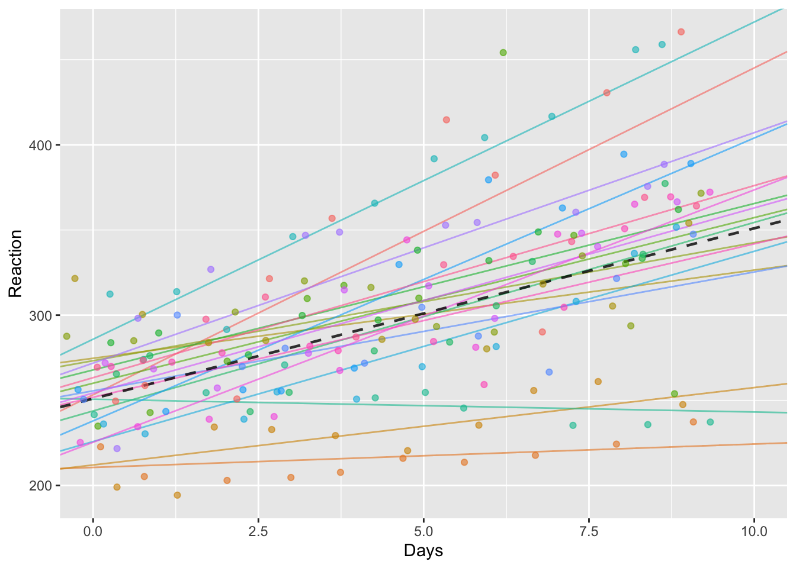
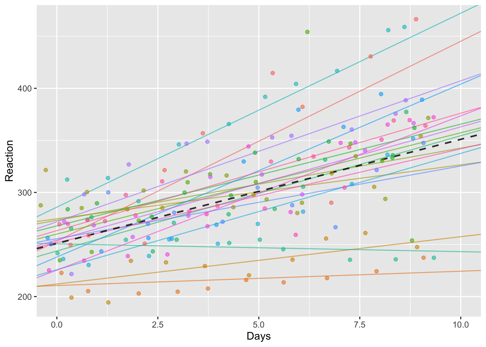
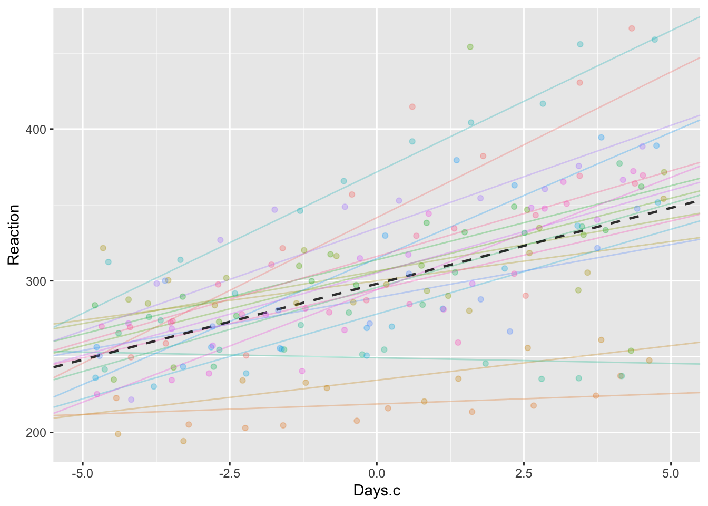
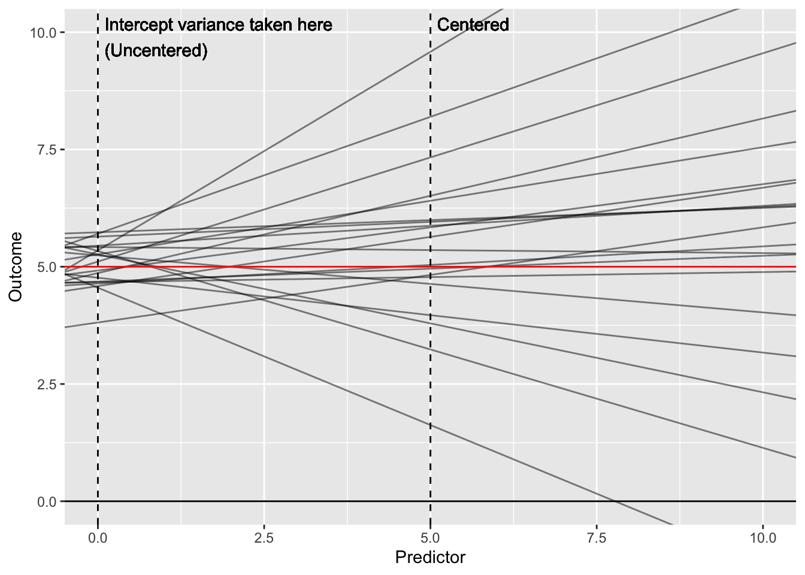
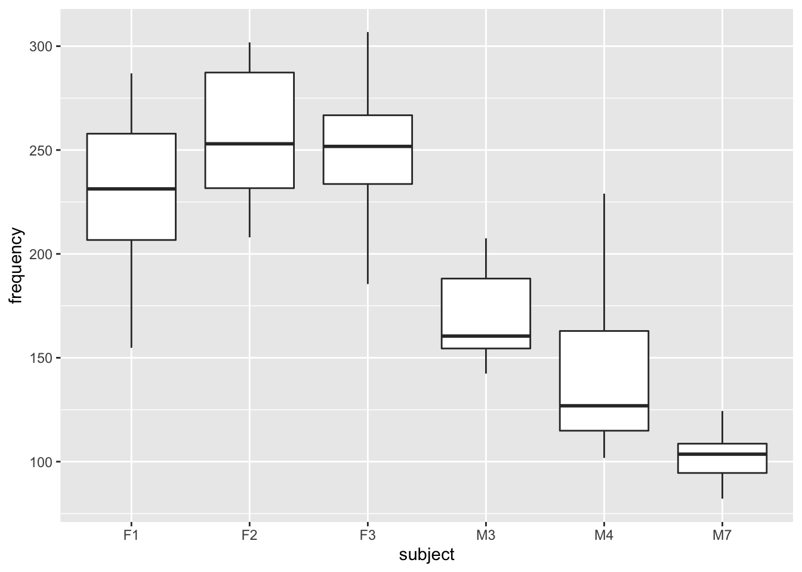
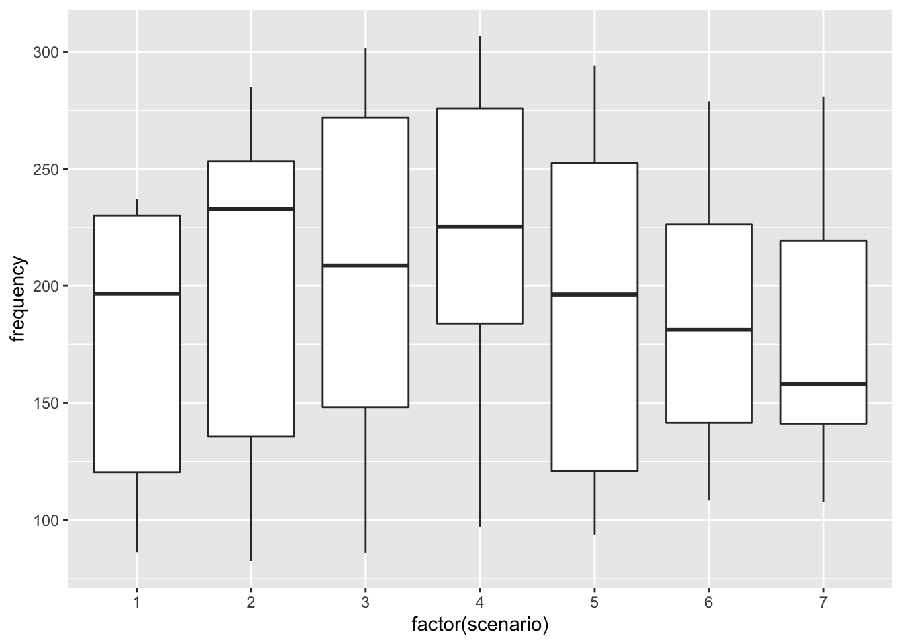

# Random effects {#random-effects}


### In brief

> In this session we specify more complex random effects, including examples from
> experimental data with multiple sources of variation. We use visualisation techniques
> to explore the concept of 'shrinkage'.


Find the [slides from the session here](slides/random-effects.pptx)


## Sleep (centering)

In the previous session we saw how random intercepts can be used to fit different slopes for different individuals (or groupings) in the data.

The following data show the increased in reaction times over the course of a 10 days experiment in which participants suffered sleep deprivation:


##### {#sleepplot}




:::{.exercise}

- Is there substantial variation between subjects in reaction times on average?
- Is there substantial variation in the effect of sleep deprivation?


<div class='solution'><button class='solution-button'>Solution</button>


There's certainly variation in the slopes between individuals, and the effect of sleep deprivation does seem to differ markedly between individuals.

However, deciding whether there is variation between people on average is less clear-cut. We need to decide on which day we want to compare the variation. For example, at day 0 there doesn't seem to be much variation. But by day 5 there does, and by day 10 there is a lot.


As we'll see, to estimate this variation from a model we need to be careful about how we include our covariates (e.g. days in this case).


</div>


:::


#### Centering coefficients

The plot above was based on the following random slopes model:


```r
(sleep.m1 <- lmer(Reaction ~ Days + (Days | Subject), ss))
```

```
Linear mixed model fit by REML ['lmerModLmerTest']
Formula: Reaction ~ Days + (Days | Subject)
   Data: ss
REML criterion at convergence: 1743.628
Random effects:
 Groups   Name        Std.Dev. Corr
 Subject  (Intercept) 24.737       
          Days         5.923   0.07
 Residual             25.592       
Number of obs: 180, groups:  Subject, 18
Fixed Effects:
(Intercept)         Days  
     251.41        10.47  
```


If we look at the dataset, we can see that there are 10 rows for each `Subject`, with days indexed from 0 to 9.


```r
sleepstudy %>% head(15) %>% pander()
```


---------------------------
 Reaction   Days   Subject 
---------- ------ ---------
  249.6      0       308   

  258.7      1       308   

  250.8      2       308   

  321.4      3       308   

  356.9      4       308   

  414.7      5       308   

  382.2      6       308   

  290.1      7       308   

  430.6      8       308   

  466.4      9       308   

  222.7      0       309   

  205.3      1       309   

   203       2       309   

  204.7      3       309   

  207.7      4       309   
---------------------------


As we know from linear regression, when we include parameters thet estimated in such a way that when we look at them individually they are the estimate for an individual row ***if all the other predictors were set to zero***.

In multiple regression this is important because it affects how we interpret the paramaters. When we include multiple predictors it can be hard to read the table of model parameters because we need to add together multiple paramaters to make a prediction. We can get around this using the `predict` function, but the key is that the scale of the

For example, if we use the mtcars data we can see that to estimate a heavy automatic car (high `wt` and `am`=1), we would have to do some arithmetic:


```r
lm(mpg~wt*am, data=mtcars)
```

```

Call:
lm(formula = mpg ~ wt * am, data = mtcars)

Coefficients:
(Intercept)           wt           am        wt:am  
     31.416       -3.786       14.878       -5.298  
```

Because weight in this sample ranges from 1.513 to 5.424, simply adding the intercpt, `wt` and `am` paramaters would not be an estimate for any car in the sample, because none of them had zero weight.


If, on the other hand, we had ***mean-centered*** `wt` --- that is, subtracted the mean from each value --- then we could interpret the other coefficients as being the prediction when *`wt` was at the average value in the sample*.


```r
mt2 <- mtcars %>% mutate(wt = wt - mean(wt))
lm(mpg~wt*am, data=mt2)
```

```

Call:
lm(formula = mpg ~ wt * am, data = mt2)

Coefficients:
(Intercept)           wt           am        wt:am  
     19.236       -3.786       -2.168       -5.298  
```


By centering the `wt` predictor the other coefficients change (although the model itself is really the same---the amount of variance explained is identical, for instance):


<div class='solution'><button class='solution-button'>Show R squared figures</button>


```r
# original
broom::glance(lm(mpg~wt*am, data=mtcars)) %>% pull(r.squared)
```

```
[1] 0.8330375
```

```r
# centered
broom::glance(lm(mpg~wt*am, data=mt2)) %>% pull(r.squared)
```

```
[1] 0.8330375
```


</div>


#### Why centering matters especially for mixed models


In multiple regression centering predictors can be a convenience, but doesn't affect the model fit[^collinfit]. We can always do arithmetic on our coefficients to convert from one configuration to the another when making predictions.

[^collinfit]: This is mostly true. The only exception is when parameters are collinear (see PSYC753 materials); in this case numerical issues when fitting models can lead to small differences, but this is mostly not the case.


***This is not true for mixed models***. How we include predictors changes estimates for our variance paramaters. To see why, consider the example we began with, from the `sleepstudy` data:




If we centered the Days coefficient, the  plot would look like this:


```
Linear mixed model fit by REML ['lmerModLmerTest']
Formula: Reaction ~ Days + (Days | Subject)
   Data: ss
REML criterion at convergence: 1743.628
Random effects:
 Groups   Name        Std.Dev. Corr
 Subject  (Intercept) 24.737       
          Days         5.923   0.07
 Residual             25.592       
Number of obs: 180, groups:  Subject, 18
Fixed Effects:
(Intercept)         Days  
     251.41        10.47  
```

```
Linear mixed model fit by REML ['lmerModLmerTest']
Formula: Reaction ~ Days.c + (Days.c | Subject)
   Data: ss
REML criterion at convergence: 1743.628
Random effects:
 Groups   Name        Std.Dev. Corr
 Subject  (Intercept) 37.522       
          Days.c       5.921   0.75
 Residual             25.593       
Number of obs: 180, groups:  Subject, 18
Fixed Effects:
(Intercept)       Days.c  
     298.51        10.47  
```




Nothing has changed, *except the scale of the x axis*. The x axis is now `Days.c` which ranges from -5 to 5, and 0 is in the middle; previously `Days` ranged from 0 to 9, with 5 as the midpoint.

BUT this small change is important because our paramaters are estimates when all the *other* predictors = zero.

This means that when we use the centered predictor our random intercept variance --- the variation between people --- is estimated for the midpoint of the study, because day 5 is coded as zero in `Days.c`.

We can see the effect on the variance paramaters if we compare the output of VarCorr. First uncentered:


```r
VarCorr(sleep.m1)
```

```
 Groups   Name        Std.Dev. Corr 
 Subject  (Intercept) 24.7366       
          Days         5.9229  0.066
 Residual             25.5918       
```

And then centered:


```r
VarCorr(sleep.m1.c)
```

```
 Groups   Name        Std.Dev. Corr 
 Subject  (Intercept) 37.5221       
          Days.c       5.9212  0.753
 Residual             25.5930       
```

When we centre `Days` then the proportion of variance attributed to subjects changes from about 80% to over 86%.


-----------------------------


This plot simplifies and shows the difference between models with centered and uncentered predictors. The vertical dashed lines show where the variance for the random intercept would be taken from in each case:




#### What's the right thing to do?

It depends on what your question is!

In the `sleepstudy` example we might argue that the first (uncentered) model makes more sense because there is a definite start to the experiment: At Day 0 we have people in their 'natural' state, before we deprive them of sleep. So in this model the `(Intercept)` term describes the varation between people in the normal state.

However in other cases this wouldn't be true. For example, let's say we used the Scottish schools data and included the `year` each cohort was taken in as a predictor:


```r
schools.1 <- lmer(score ~ year + (year|schoolid), data=schools)
VarCorr(schools.1)                  
```

```
 Groups   Name        Std.Dev.  Corr  
 schoolid (Intercept) 14.770619       
          year         0.011085 -1.000
 Residual             14.796990       
```

Now, the between-school variance is estimated in the year 0 (i.e. >2000 years ago), which clearly doesn't make much sense. If we compare the ICC (or % variance-attributable) within and between schools it makes a huge difference:


```r
schools.2 <- lmer(score ~ cohort90 + (cohort90|schoolid), data=schools)

bind_rows(
  VarCorr(schools.1) %>% as.tibble() %>% mutate(Centered="No"),
  VarCorr(schools.2) %>% as.tibble() %>% mutate(Centered="Yes")) %>%
  filter(is.na(var2)) %>%
  group_by(Centered) %>%
  mutate(icc=round(vcov / sum(vcov) * 100, 2)) %>%
  select(grp, var1, icc) %>%
  rename(Grouping=grp, Parameter=var1, `%`=icc) %>%
  pander()
```


-------------------------------------------
 Centered   Grouping    Parameter      %   
---------- ---------- ------------- -------
    No      schoolid   (Intercept)   49.91 

    No      schoolid      year         0   

    No      Residual       NA        50.09 

   Yes      schoolid   (Intercept)   16.6  

   Yes      schoolid    cohort90     0.06  

   Yes      Residual       NA        83.34 
-------------------------------------------

In this case it makes no sense to estimate the variance when `year` = 0 and we should definitely center the variables.


**If you're not sure, however, it's probably safer to center predictors in mixed models.**


:::{.exercise}

Return to the piglets example from sessions 1 and 2.

- Refit the model with centered predictors
- Calculate the variance partition by differences between piglets using centered and uncentered models. What differences do you spot?
- Which parameterisation most sense in this case? Are we more interested in variation between pigs at the start or the middle of the study?

:::


## MMA

](images/mma.jpg)


The following data are a tidied-up version of the data made available by the authors of the MMA paper we discussed in class [@pavelka2020acute]. The `included` column tells whether the row was included in the authors' analysis from the paper. By filtering out non-included rows we can make our results match exactly.


```r
mma  <- read_csv('data/mma_bw.csv') %>% filter(included==TRUE)
```


:::{.exercise}

- Import the tidied the data (from [this file](data/mma_bw.csv))

- Fit the model described in the paper (in their supplement the authors reveal that `stimulus` and `FI` were mean-centered).


<div class='solution'><button class='solution-button'>How do I mean-centre things?</button>


```r
mma.c <- mma %>%
  mutate(FI.c = FI - mean(FI), stimulus.c = stimulus - mean(stimulus))
mma.c %>% head
```

```
# A tibble: 6 x 8
  person condition    RT    FI stimulus included  FI.c stimulus.c
   <dbl> <chr>     <dbl> <dbl>    <dbl> <lgl>    <dbl>      <dbl>
1      1 before      251  57.2        6 TRUE      13.5     -10.5 
2      1 before      264  57.2        7 TRUE      13.5      -9.51
3      1 before      221  57.2        8 TRUE      13.5      -8.51
4      1 before      221  57.2        9 TRUE      13.5      -7.51
5      1 before      256  57.2       10 TRUE      13.5      -6.51
6      1 before      281  57.2       11 TRUE      13.5      -5.51
```


</div>


<div class='solution'><button class='solution-button'>Show the model</button>


```r
(mma.m1 <- lmer(RT ~ 1 + condition + stimulus.c + FI.c + condition:stimulus.c + (1|person), data=mma.c))
```

```
Linear mixed model fit by REML ['lmerModLmerTest']
Formula: RT ~ 1 + condition + stimulus.c + FI.c + condition:stimulus.c +  
    (1 | person)
   Data: mma.c
REML criterion at convergence: 22125.95
Random effects:
 Groups   Name        Std.Dev.
 person   (Intercept) 38.46   
 Residual             40.02   
Number of obs: 2150, groups:  person, 45
Fixed Effects:
               (Intercept)             conditionbefore  
                 270.18446                    -4.03080  
                stimulus.c                        FI.c  
                  -0.26609                    -0.25665  
conditionbefore:stimulus.c  
                  -0.05753  
```


</div>


- Look at the effect of `condition` in your model. Does this match the authors' report that "POST RTs were found significantly higher than PRE (mean difference = 4.031 ms, SE = 1.726"?


<div class='solution'><button class='solution-button'>Show answer</button>


Yes: the `conditionbefore` coefficient from your model should have been -4.03 also. The direction is reversed because the authors' encoded their model slightly differently (their parameter would have been called `conditionafter`) but the meaning is the same.

To see the SE, use `summary` and `coef` together:


```r
summary(mma.m1) %>% coef() %>% pander()
```


--------------------------------------------------------------------------------------
             &nbsp;               Estimate   Std. Error    df     t value   Pr(>|t|)  
-------------------------------- ---------- ------------ ------- --------- -----------
        **(Intercept)**            270.2       5.861      44.93    46.1     1.777e-39 

      **conditionbefore**          -4.031      1.726      2102    -2.335     0.01964  

         **stimulus.c**           -0.2661      0.1766     2102    -1.507      0.132   

            **FI.c**              -0.2566      0.6756      43     -0.3799    0.7059   

 **conditionbefore:stimulus.c**   -0.05753     0.2495     2102    -0.2306    0.8176   
--------------------------------------------------------------------------------------


This is 0.17660, which is what the authors report.


</div>


- Are the reported findings robust to minor changes in the model fitting? For example, if parameters are removed or if the excluded data is incorporated?


<div class='solution'><button class='solution-button'>Show details</button>


This model, excluding fatigue (`FI`), predicts the same 4ms difference:


```r
mma.m2 <- lmer(RT ~ 1 + condition * stimulus.c + (stimulus.c|person), data=mma.c)
summary(mma.m2) %>% coef() %>% pander()
```


-------------------------------------------------------------------------------------
             &nbsp;               Estimate   Std. Error    df     t value   Pr(>|t|) 
-------------------------------- ---------- ------------ ------- --------- ----------
        **(Intercept)**            270.2       5.804      45.98    46.55    2.49e-40 

      **conditionbefore**          -4.027      1.712      2058    -2.352    0.01876  

         **stimulus.c**           -0.2673      0.2072     106.4    -1.29     0.1999  

 **conditionbefore:stimulus.c**   -0.05712     0.2474     2059    -0.2309    0.8174  
-------------------------------------------------------------------------------------

However this model fit includes all the excluded data and predicts a 2ms difference in the other direction, and is not statistically significant:


```r
mma.all  <- read_csv('data/mma_bw.csv') %>%
  mutate(stimulus.c = stimulus-mean(stimulus), FI.c = FI-mean(FI), )
mma.m3 <- lmer(RT ~ 1 + condition + stimulus.c + FI.c + condition:stimulus.c +  (1 | person), data=mma.all)
mma.m3 %>% summary() %>% coef() %>% pander()
```


--------------------------------------------------------------------------------------
             &nbsp;               Estimate   Std. Error    df     t value   Pr(>|t|)  
-------------------------------- ---------- ------------ ------- --------- -----------
        **(Intercept)**             271        6.129      51.92    44.22    6.936e-43 

      **conditionbefore**          2.198       3.685      2467    0.5964     0.5509   

         **stimulus.c**           -0.3548      0.3225     2467     -1.1      0.2715   

            **FI.c**               0.3986      0.6813     42.99    0.585     0.5616   

 **conditionbefore:stimulus.c**    -1.169      0.4565     2467    -2.561     0.01051  
--------------------------------------------------------------------------------------


</div>


- How should we interpret these findings, based on the replications you have made?


:::


## Politeness

Winter & Grawunder, 2012 describe a study of the pitch (frequency) of individuals' speech when they recorded different phrases (scenarios). The scenarios differed in whether they required 'politeness' or were more informal in nature. A reduced version of this dataset is also described and analysed in a mixed-models tutorial (see http://www.bodowinter.com/uploads/1/2/9/3/129362560/bw_lme_tutorial2.pdf).

The data are available online and can be read from this URL:


```r
# this previously taken from http://www.bodowinter.com/tutorial/politeness_data.csv but that link is now broken
politeness <-  read_csv("https://raw.githubusercontent.com/opetchey/BIO144/master/3_datasets/politeness_data.csv")
```


:::{.exercise}

1. Make a plot showing how average levels of frequency differs *between individuals*.


<div class='solution'><button class='solution-button'>Show me the plot</button>


```r
politeness %>%
  ggplot(aes(subject, frequency)) + geom_boxplot()
```




</div>


2. Make a plot showing how frequency differs *between scenarios*


<div class='solution'><button class='solution-button'>Show me the plot</button>


```r
politeness %>%
  ggplot(aes(factor(scenario), frequency)) + geom_boxplot()
```




</div>


3. Based on the plots, which do you think accounts for more variation in frequency: `subject` or `scenario`?


<div class='solution'><button class='solution-button'>Show answer</button>


It looks like subjects vary more in frequency than do scenarios, but there appears to be variation attributable to both variables.


</div>


4. Fit a random intercepts model to the data, allowing for variation between subjects. Include fixed effects for `attitude` and `gender`:


<div class='solution'><button class='solution-button'>Show me that model</button>


```r
(polite.ri.subject <- lmer(frequency ~ attitude + gender + (1|subject), data=politeness))
```

```
Linear mixed model fit by REML ['lmerModLmerTest']
Formula: frequency ~ attitude + gender + (1 | subject)
   Data: politeness
REML criterion at convergence: 786.7439
Random effects:
 Groups   Name        Std.Dev.
 subject  (Intercept) 24.57   
 Residual             29.17   
Number of obs: 83, groups:  subject, 6
Fixed Effects:
(Intercept)  attitudepol      genderM  
     256.69       -19.41      -108.20  
```


</div>


<div class='solution'><button class='solution-button'>What other commands should I run to interpret the model at this point?</button>

You might then also want to look at the regression coefficients, Anova table, and tests of random effects:


```r
# regression coefficients
polite.ri.subject %>% summary %>% coef() %>% pander(caption="Model coefficients")
```


----------------------------------------------------------------------
     &nbsp;        Estimate   Std. Error    df     t value   Pr(>|t|) 
----------------- ---------- ------------ ------- --------- ----------
 **(Intercept)**    256.7       15.23      4.378    16.86    3.78e-05 

 **attitudepol**    -19.41      6.407      76.02    -3.03    0.003345 

   **genderM**      -108.2      21.06      4.009   -5.137    0.006766 
----------------------------------------------------------------------

Table: Model coefficients

```r
# anova-table
anova(polite.ri.subject) %>% pander(caption="Anova table")
```


----------------------------------------------------------------------
    &nbsp;      Sum Sq   Mean Sq   NumDF   DenDF   F value    Pr(>F)  
-------------- -------- --------- ------- ------- --------- ----------
 **attitude**    7810     7810       1     76.02    9.179    0.003345 

  **gender**    22457     22457      1     4.009    26.39    0.006766 
----------------------------------------------------------------------

Table: Anova table

```r
# tests of random effects
ranova(polite.ri.subject) %>% pander(caption="Test of random intercepts")
```


---------------------------------------------------------------------
      &nbsp;         npar   logLik    AIC     LRT    Df   Pr(>Chisq) 
------------------- ------ -------- ------- ------- ---- ------------
    **<none>**        5     -393.4   796.7    NA     NA       NA     

 **(1 | subject)**    4     -404.7   817.4   22.68   1    1.909e-06  
---------------------------------------------------------------------

Table: Test of random intercepts


</div>


4. Fit a second random intercepts model, allowing for variation in both subjects and between the different scenarios.


<div class='solution'><button class='solution-button'>Show me that model</button>


```r
polite.ri.both <- lmer(frequency ~ attitude + gender +
                         (1|subject) + (1|scenario), data=politeness)

# test of random effect
ranova(polite.ri.both)
```

```
ANOVA-like table for random-effects: Single term deletions

Model:
frequency ~ attitude + gender + (1 | subject) + (1 | scenario)
               npar  logLik    AIC    LRT Df Pr(>Chisq)    
<none>            6 -387.73 787.45                         
(1 | subject)     5 -402.50 815.00 29.546  1  5.461e-08 ***
(1 | scenario)    5 -393.37 796.74 11.289  1  0.0007796 ***
---
Signif. codes:  0 '***' 0.001 '**' 0.01 '*' 0.05 '.' 0.1 ' ' 1
```


</div>


5. How much variance was attributable to subjects or scenarios, compared with the total variance?


<div class='solution'><button class='solution-button'>Show me how to calculate this</button>


Remember to convert the `VarCorr` output to a dataframe to see the variance (rather than standard deviations) in the `vcov` column. You can then use `mutate` or `transmute` to calculate the within/betwen ratio (the ICC).


```r
polite.ri.both %>% VarCorr() %>% as_tibble() %>%
  transmute(
    Term=Hmisc::capitalize(grp),
    `% variation`=round(vcov / sum(vcov) * 100, 1)
  ) %>%
  pander()
```


------------------------
   Term     % variation 
---------- -------------
 Scenario      14.8     

 Subject       41.6     

 Residual      43.6     
------------------------


</div>


6. Add random slopes to the model above. Allow the effect of `attitude` (whether the scenario was polite or informal) to differ between subjects, and also to differ between the different example scenarios sampled in this study.


<div class='solution'><button class='solution-button'>Show me that model formula</button>


```r
frequency ~ attitude + gender + (attitude|subject) + (attitude|scenario)
```

```
frequency ~ attitude + gender + (attitude | subject) + (attitude | 
    scenario)
```


</div>


7. Use `ranova` to test whether the random slopes improved the model


<div class='solution'><button class='solution-button'>Show me how</button>


First run the model:


```r
polite.rslopes <- lmer(frequency ~ attitude + gender + (attitude|subject) +
                         (attitude|scenario), data=politeness)
```


:::{.tip}

If you see a message saying `boundary (singular) fit: see ?isSingular` don't worry for now. This IS actually quite important, but we will discuss it in more detail in the next session.

:::


And then use `ranova`:


```r
ranova(polite.rslopes)
```

```
ANOVA-like table for random-effects: Single term deletions

Model:
frequency ~ attitude + gender + (attitude | subject) + (attitude | 
    scenario)
                                  npar  logLik    AIC     LRT Df Pr(>Chisq)
<none>                              10 -387.54 795.08                      
attitude in (attitude | subject)     8 -387.55 791.10 0.02468  2     0.9877
attitude in (attitude | scenario)    8 -387.71 791.43 0.35218  2     0.8385
```

Both of the `Pr(>Chisq)` values (the *p* values for the chi squared test) are non-significant.

You might also note this more complex model had some problems fitting: Don't worry for now, but we will cover with this in the final session.


</div>


7. If a random slopes model is not 'significantly' better than a similar model which does not include the random slope term, is there any reason why we  might still prefer it, and use the 'full' model to base our inference on?


<div class='solution'><button class='solution-button'>Show answer</button>


Yes - simulation studies, including Barr et al 2013 suggest that a 'maximal' model is likely to be more conservative than a model which excludes non-significant random effects terms.


</div>


8. How might mixed models make the problem of 'researcher degrees of freedom' worse? What effect might this have? How can it be avoided?


<div class='solution'><button class='solution-button'>Show answer</button>


Mixed models provide many more possible 'ways to do it'. In addition to different fixed-effects specifications we can now also have many different random effects specifications. This increases degrees of freedom in the analysis, and makes it even more important to pre-specify analyses.


</div>


:::


## Model complexity


Although @barr2013random exhort researchers to 'keep it maximal', and include as many random effects in the model as implied by the design, this isn't always possible.

Mixed models with many random effects can be difficult to fit. You will already have seen error messages about 'singular fits' and 'non-convergence'.

Two important points:

- Non-converged models, or models with fit errors should NOT be interpreted or reported. Results from them are quite likely to be unstable/incorrect.

- The easiest/most immediate way to get rid of the errors is to simplify the model


Taking one of the examples from above:


```r
(sleep.rs <- lmer(Reaction ~ Days + (Days|Subject), data=ss))
```

```
Linear mixed model fit by REML ['lmerModLmerTest']
Formula: Reaction ~ Days + (Days | Subject)
   Data: ss
REML criterion at convergence: 1743.628
Random effects:
 Groups   Name        Std.Dev. Corr
 Subject  (Intercept) 24.737       
          Days         5.923   0.07
 Residual             25.592       
Number of obs: 180, groups:  Subject, 18
Fixed Effects:
(Intercept)         Days  
     251.41        10.47  
```


This model contains 3 random effects parameters which have to be estimated from the data (not including the residual variance):


```r
sleep.rs %>% VarCorr
```

```
 Groups   Name        Std.Dev. Corr 
 Subject  (Intercept) 24.7366       
          Days         5.9229  0.066
 Residual             25.5918       
```


They are:

- Random intercept term for Subject 
- Random slope for Days within Subject
- The covariance of intercept and slope within Subject


Often, we will not have enough data to properly estimate all these paramaters. However, as Barr et al recommend, we can exclude parameters from the model by:

- Explicitly specifying the random intercept with `(1|grouping)`
- Adding another term which is `(0 + variable | grouping)`

Here, the `0+` means remove the random intercept. By specifying the random effects in different parts (i.e. within separate sets of brackets) lmer knows the terms are not correlated.


```r
sleep.rs.simplified <- lmer(Reaction ~ Days + (1|Subject) + (0+Days|Subject), data=ss)
sleep.rs.simplified %>% VarCorr
```

```
 Groups    Name        Std.Dev.
 Subject   (Intercept) 25.0499 
 Subject.1 Days         5.9887 
 Residual              25.5652 
```


## Extensions

### Factorial anova in mixed models

The file [journal.pone.0226387.s001.sav](data/journal.pone.0226387.s001.sav) contains data from @kemps2019cognitive.
These have been reshaped to long format and tidied up in [data/drinks.csv](data/drinks.csv).

The study explored the effect of an cognitive bias modification intervention, and one of the outcomes was Attentional Bias in a dot-probe task.

There were two experimental conditions (between subjects) and participants were tested twice. The original paper reported results from a mixed model in which `Time` was a repeated/within-subjects factor.


```r
drinks %>% head %>% pander("6 rows from the `drinks` dataset")
```


---------------------------------------------------------
 Participant   Condition   Age   Gender   Time   AttBias 
------------- ----------- ----- -------- ------ ---------
      1         Attend     18    Female   Pre    -5.794  

      1         Attend     18    Female   Post   -17.86  

      2          Avoid     19    Female   Pre     -5.19  

      2          Avoid     19    Female   Post    26.08  

      3         Attend     24     Male    Pre      27    

      3         Attend     24     Male    Post    15.81  
---------------------------------------------------------

Table: 6 rows from the `drinks` dataset


Plotting the data indicates a Time*Condition interaction:


:::{.exercise}

1. Run a random intercepts model which would test the relationships shown in the plot above


<div class='solution'><button class='solution-button'>Solution</button>


```r
(drinks.m1 <- lmer(AttBias ~ Condition * Time + (1|Participant), data=drinks))
```

```
Linear mixed model fit by REML ['lmerModLmerTest']
Formula: AttBias ~ Condition * Time + (1 | Participant)
   Data: drinks
REML criterion at convergence: 2033.767
Random effects:
 Groups      Name        Std.Dev.
 Participant (Intercept)  4.975  
 Residual                19.592  
Number of obs: 232, groups:  Participant, 116
Fixed Effects:
           (Intercept)          ConditionAvoid                 TimePre  
                 9.706                 -11.991                  -4.684  
ConditionAvoid:TimePre  
                13.086  
```


</div>


2. Use the `anova` command to test the interaction of Condition and Time


<div class='solution'><button class='solution-button'>Solution</button>


```r
drinks.m1 %>% anova
```

```
Type III Analysis of Variance Table with Satterthwaite's method
                Sum Sq Mean Sq NumDF DenDF F value  Pr(>F)  
Condition      1525.01 1525.01     1   114  3.9729 0.04863 *
Time            200.51  200.51     1   114  0.5224 0.47132  
Condition:Time 2482.99 2482.99     1   114  6.4685 0.01232 *
---
Signif. codes:  0 '***' 0.001 '**' 0.01 '*' 0.05 '.' 0.1 ' ' 1
```

There does appear to be an interaction.


</div>


:::


### Follow-up tests

To run follow-up tests comparing individual cells in the design we can use another R package called `emmeans`.


```r
library(emmeans)
```


The `emmeans` function (which is inside the `emmeans` package we just loaded), can calculate means and confidence intervals for each cell in the design:


```r
emmeans(drinks.m1, ~Condition*Time)
```

```
 Condition Time emmean   SE  df lower.CL upper.CL
 Attend    Post   9.71 2.65 227    4.476    14.94
 Avoid     Post  -2.28 2.65 227   -7.515     2.95
 Attend    Pre    5.02 2.65 227   -0.207    10.25
 Avoid     Pre    6.12 2.65 227    0.887    11.35

Degrees-of-freedom method: kenward-roger 
Confidence level used: 0.95 
```

In the code above we used the `emmeans` function, and gave it the saved random intercept model as input. In the second input (where is says `~Condition*Time`) we are using a formula to describe which part of the design we would like means for.

Helpfully, you can also plot the results of this function, so the folliwing is a shortcut for writing a ggplot command yourself:


```r
plot(emmeans(drinks.m1, ~Condition*Time)) + xlab("Predicted value")
```


We can also save the results of `emmeans` and send it to the `contrast` function. This produces t tests for each pairwise comparison:


```r
savedmeans1 <- emmeans(drinks.m1, ~Condition*Time)
contrast(savedmeans1, method='pairwise', adjust='none')
```

```
 contrast                 estimate   SE  df t.ratio p.value
 Attend,Post - Avoid,Post    11.99 3.75 227  3.195  0.0016 
 Attend,Post - Attend,Pre     4.68 3.64 114  1.287  0.2006 
 Attend,Post - Avoid,Pre      3.59 3.75 227  0.956  0.3400 
 Avoid,Post - Attend,Pre     -7.31 3.75 227 -1.947  0.0528 
 Avoid,Post - Avoid,Pre      -8.40 3.64 114 -2.309  0.0227 
 Attend,Pre - Avoid,Pre      -1.09 3.75 227 -0.292  0.7708 

Degrees-of-freedom method: kenward-roger 
```

And we can add `adjust="bonferonni"` or `adjust="tukey"` method to adjust for multiple comparisons


```r
contrast(savedmeans1, method='pairwise', adjust='tukey')
```

```
 contrast                 estimate   SE  df t.ratio p.value
 Attend,Post - Avoid,Post    11.99 3.75 227  3.195  0.0086 
 Attend,Post - Attend,Pre     4.68 3.64 114  1.287  0.5728 
 Attend,Post - Avoid,Pre      3.59 3.75 227  0.956  0.7744 
 Avoid,Post - Attend,Pre     -7.31 3.75 227 -1.947  0.2116 
 Avoid,Post - Avoid,Pre      -8.40 3.64 114 -2.309  0.1019 
 Attend,Pre - Avoid,Pre      -1.09 3.75 227 -0.292  0.9913 

Degrees-of-freedom method: kenward-roger 
P value adjustment: tukey method for comparing a family of 4 estimates 
```


If we want to compare pairs of groups, we can adjust the formula we pass to the `emmeans` function. In the example below I compare Conditions averaged across both time periods:


```r
savedmeans2 <- emmeans(drinks.m1, ~Condition)
contrast(savedmeans2, method='pairwise')
```

```
 contrast       estimate   SE  df t.ratio p.value
 Attend - Avoid     5.45 2.73 114 1.993   0.0486 

Results are averaged over the levels of: Time 
Degrees-of-freedom method: kenward-roger 
```

In this example we compare the Pre and Post measurement times *within* each group (here the bar symbol, `|`, is read as 'within'):


```r
savedmeans3 <- emmeans(drinks.m1, ~Time|Condition)
contrast(savedmeans3, method='pairwise')
```

```
Condition = Attend:
 contrast   estimate   SE  df t.ratio p.value
 Post - Pre     4.68 3.64 114  1.287  0.2006 

Condition = Avoid:
 contrast   estimate   SE  df t.ratio p.value
 Post - Pre    -8.40 3.64 114 -2.309  0.0227 

Degrees-of-freedom method: kenward-roger 
```


:::{.tip}

##### Useful `emmeans` examples


```r
# get the means of all combinations of factors A and B
emmeans(model, ~A+B)

# menas the same as the line above
emmeans(model, ~A*B)

# show all pairwise contrasts for all combinations of A and B
contrast(emmeans(model, pairwise~A+B), pairwise)

# show tests of the effect of A within each level of B
contrast(emmeans(model, pairwise~A|B), pairwise)

# show the confidence interval for the tests above:
confint(contrast(emmeans(model, pairwise~A|B), pairwise))
```

:::


:::{.exercise}

- Adjust the code using `emmeans` and `contrast` above to compare Pre vs Post scores (averaged across Condition)
- Compare the conditions *within* each time period.


<div class='solution'><button class='solution-button'>Solution</button>


```r
# compare times averaged across conditions
contrast(emmeans(drinks.m1, ~Time), method='pairwise')
```

```
 contrast   estimate   SE  df t.ratio p.value
 Post - Pre    -1.86 2.57 114 -0.723  0.4713 

Results are averaged over the levels of: Condition 
Degrees-of-freedom method: kenward-roger 
```

```r
# compare conditions within each time
contrast(emmeans(drinks.m1, ~Condition|Time), method='pairwise')
```

```
Time = Post:
 contrast       estimate   SE  df t.ratio p.value
 Attend - Avoid    11.99 3.75 227  3.195  0.0016 

Time = Pre:
 contrast       estimate   SE  df t.ratio p.value
 Attend - Avoid    -1.09 3.75 227 -0.292  0.7708 

Degrees-of-freedom method: kenward-roger 
```


</div>

:::


## Further reading

Meteyard summarises current good practice in running and reporting mixed models [@meteyard2020best].

Barr et al -@barr2013random go into more detail on why mixed models are preferable to RM anova, and this paper will be a useful reference for future sessions too. See also @eager2017mixed which points out some of the failings of mixed models as typically used.

