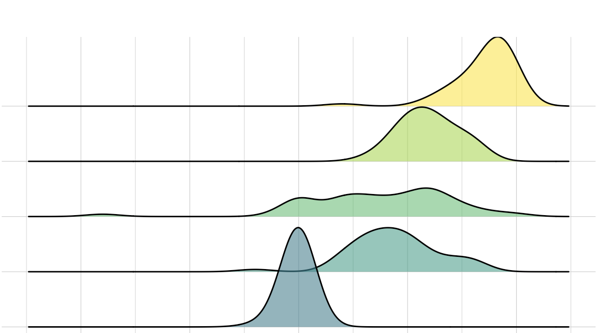

# Bayesian estimation {#bayesian-estimation}

#### In brief

> NHST often forces researchers to make contorted statements about 'straw man'
> hypotheses that are not of substantive interest. In contrast, Bayesian methods
> facilitate straightforward statements about the probability of hypotheses, given the
> data, which can aid theory development and decision making. Furthermore, many common
> designs for psychological studies generate data with random effects structures which
> can be difficult to fit with traditional methods; often estimation can be helped by
> providing normalising priors for random effects parameters. We introduce the `RStan`
> and `rstanarm` packages which make it straightforward to specify models and priors,
> estimate using simulation-based techniques, and visualise and communicate results.

<!-- 
The Bayesian New Statistics: Hypothesis testing, estimation, meta-analysis, and power analysis from a Bayesian perspective
https://link.springer.com/article/10.3758/s13423-016-1221-4 -->
