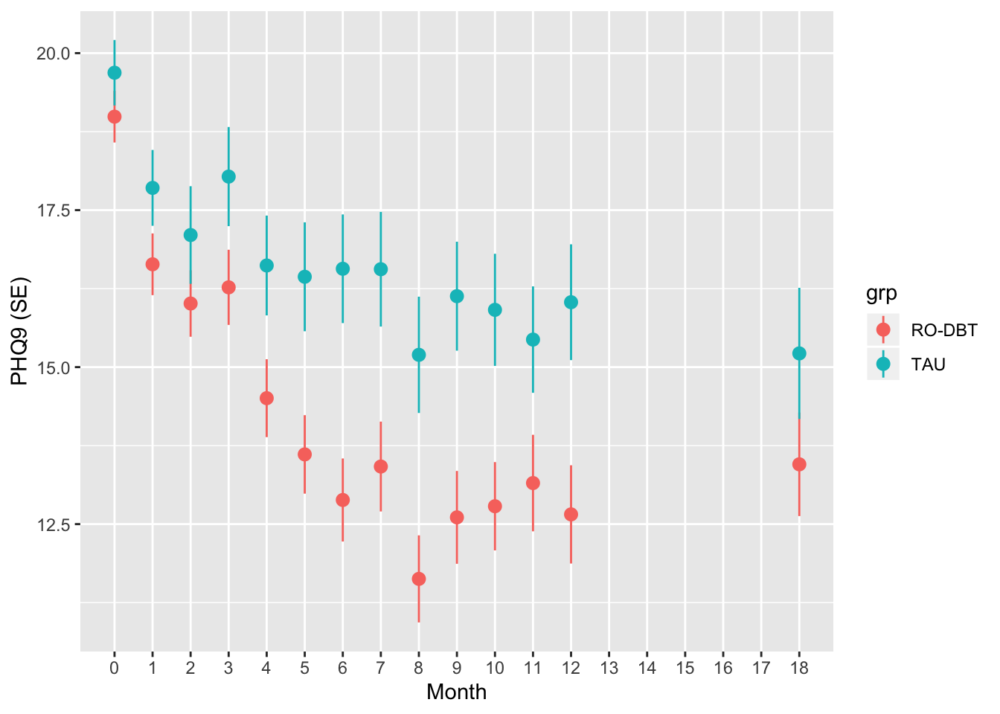

# Assessment


The REFRAMED trial was a large RCT evaluating a variant of dialectical behaviour therapy for patients with treatment-resistant depression [@]

The original, uncentered data, used for this analysis are [available here: `data/reframed.csv`](data/reframed.csv). 


1. Make a plot which shows changes in PHQ9 scores over time, split by group. It can look like the plot below, or display the differences between groups over time in another suitable way:




2. Fit a random intercepts model using `lmer`, including month as a fixed factor (a categorical variable). Also include treatment group, and the interaction of month and group. 

3. Report the model you run and interpret the model output, and report relevant statistics covered during the course. Be sure to report the % variance attributable to between-patient differences. Use the guidelines in @meteyard2020best when deciding what to report.


4. Examine the code and output below.  The variable `phq9.c` is a copy of the original dataset in which all the numeric variables have been mean-centered.

- Comment on each line, explaining what it does, and what the output (if any) means. Use the R help files as a reference to functions if needed.
- Why do you think that observations after month 12 are excluded from this analysis? 
- Which model should we prefer, `phq9.m2` or `phq9.m3`?
- What terms have been omitted from `phq9.m3`? Why might this be the case?


```r
phq9.c2 <- phq9.c %>% 
  mutate(tx=ifelse(grp=="TAU", 0, 1)) %>% 
  filter(month < 12)

phq9.m2 <- lmer(phq9 ~ month * tx + (1 | patient), data=phq9.c2)

phq9.m3 <- lmer(phq9 ~ month * tx + (1 + month:tx || patient), data=phq9.c2)

ranova(phq9.m3)
```

```
## ANOVA-like table for random-effects: Single term deletions
## 
## Model:
## phq9 ~ month + tx + (1 | patient) + (0 + month:tx | patient) + 
##     month:tx
##                                      npar  logLik   AIC     LRT Df Pr(>Chisq)
## <none>                                  7 -7050.9 14116                      
## (1 | patient)                           6 -8099.0 16210 2096.20  1  < 2.2e-16
## month:tx in (0 + month:tx | patient)    6 -7108.5 14229  115.32  1  < 2.2e-16
##                                         
## <none>                                  
## (1 | patient)                        ***
## month:tx in (0 + month:tx | patient) ***
## ---
## Signif. codes:  0 '***' 0.001 '**' 0.01 '*' 0.05 '.' 0.1 ' ' 1
```

```r
anova(phq9.m3)
```

```
## Type III Analysis of Variance Table with Satterthwaite's method
##          Sum Sq Mean Sq NumDF   DenDF F value    Pr(>F)    
## month    747.70  747.70     1 2102.47 55.4263 1.407e-13 ***
## tx        93.59   93.59     1  248.58  6.9377  0.008969 ** 
## month:tx  63.91   63.91     1  330.16  4.7373  0.030224 *  
## ---
## Signif. codes:  0 '***' 0.001 '**' 0.01 '*' 0.05 '.' 0.1 ' ' 1
```


```r
phq9.m2 %>% anova
```

```
## Type III Analysis of Variance Table with Satterthwaite's method
##          Sum Sq Mean Sq NumDF  DenDF F value    Pr(>F)    
## month    752.05  752.05     1 2244.3 49.4829 2.647e-12 ***
## tx        98.93   98.93     1  250.2  6.5092   0.01133 *  
## month:tx  90.60   90.60     1 2240.6  5.9612   0.01470 *  
## ---
## Signif. codes:  0 '***' 0.001 '**' 0.01 '*' 0.05 '.' 0.1 ' ' 1
```

```r
phq9.m3 %>% anova
```

```
## Type III Analysis of Variance Table with Satterthwaite's method
##          Sum Sq Mean Sq NumDF   DenDF F value    Pr(>F)    
## month    747.70  747.70     1 2102.47 55.4263 1.407e-13 ***
## tx        93.59   93.59     1  248.58  6.9377  0.008969 ** 
## month:tx  63.91   63.91     1  330.16  4.7373  0.030224 *  
## ---
## Signif. codes:  0 '***' 0.001 '**' 0.01 '*' 0.05 '.' 0.1 ' ' 1
```


