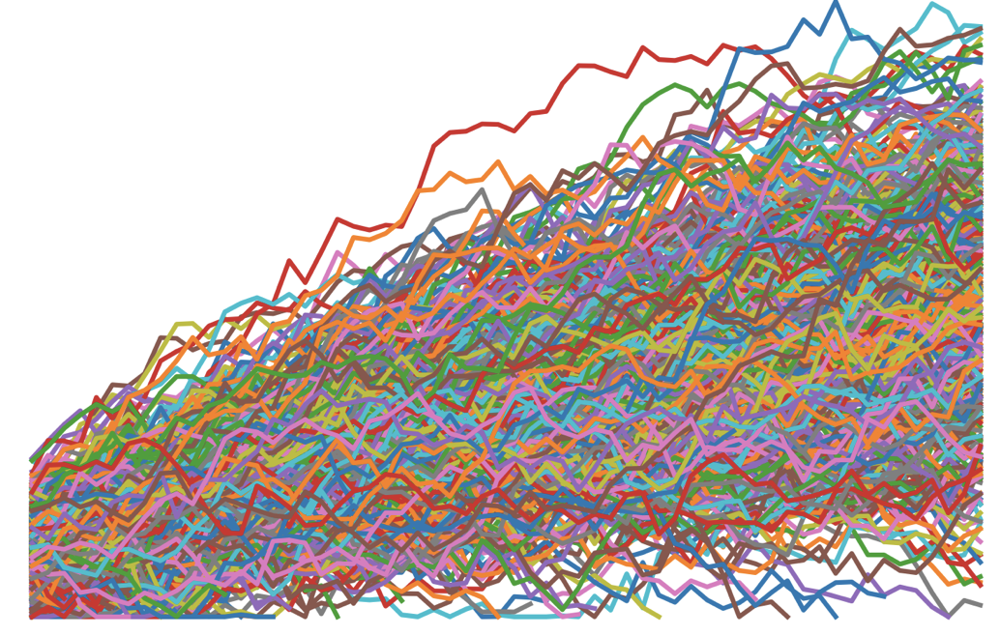

```{r, include=F, echo=F}
knitr::opts_chunk$set(echo = TRUE, collapse=TRUE, cache=TRUE, comment=NA, message=FALSE)
```

# {-}



> This option aims to extend skills to work with and analyse repeated measures data from
> typical experimental and applies studies in psychology. We will cover repeat measures
> Anova designs, mixed-effects models, touch on Bayesian parameter estimation for mixed,
> and learn how to test specific hypotheses from mixed models.

### Approach of the course

In common with all modules at Plymouth, we try to avoid the 'bag of tricks' approach to
teaching research methods and try to integrate new skills into a broader approach to
collecting and using data. Our workflow is inspired by Wickham's model for data science:
[Wickham, 2017](http://r4ds.had.co.nz/introduction.html):


In this option we do teach specific techniques, but the aim is always to help you
integrate this new knowledge into your own research practice.

### Access to R

Throughout the module we use R for data processing and analysis.

If you are taking this course at Plymouth University, the easiest way to run the code
examples here is to the school's RStudio Server.

-   [Login to your account on the server here](https://rstudio.plymouth.ac.uk)
-   To get an account on the server, or reset a password,
    [contact the Psychology technical office](http://www.psy.plymouth.ac.uk/home/)

#### Installing at home

If you want to install R on your own machine, instructions are available here:

-   <https://github.com/plymouthPsychology/installR/>

Be sure to install the recommended packages or the examples given here won't work.

### License

All content on this site distributed under a
[Creative Commons](https://creativecommons.org/) licence. CC-BY-SA 4.0.
