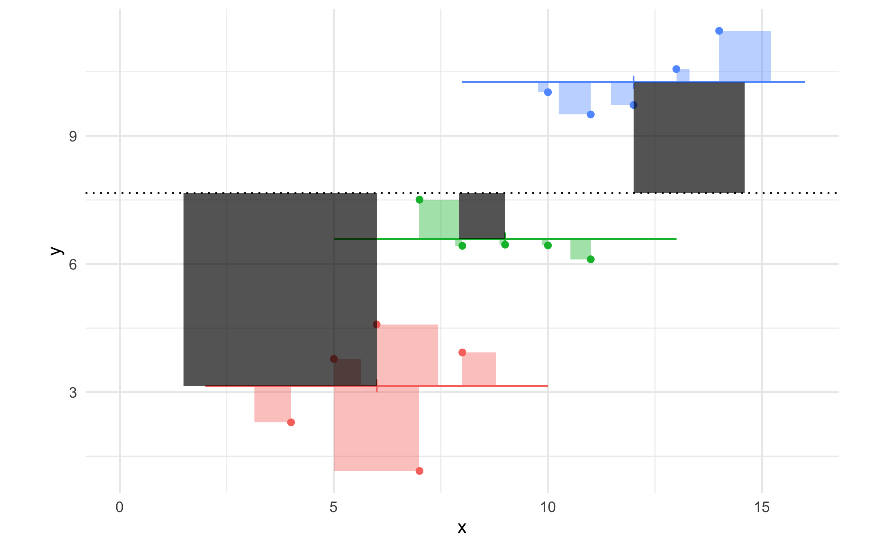

- Use `group_by` and `summarize` to calculate the mean and variance of `score` within each of the schools, and the sample size in each school (you can use `n = length(score)` to count the number of observations within each school).

- Plot the mean of each school (y axis) against the $1/var$ of the school (x axis).

- Think about which observations you 'trust' most? Why?


`r hide("What is 1/var?")`

Taking $1/var$ is often called the 'inverse variance' of a measurement. The larger $1/var$ is, the more confidence we have in the measurement.

If we want to take the average of all schools, then we might 'weight' measurements by their precision.

This is, in fact, how meta analysis works: smaller studies are down-weighted in proportion to their precision, not just their sample size. The weighted average in a meta analysis could be calculated as where $y_i$ is the outcome in a particular study, $i$.

$\hat{y} = \frac{\sum_i y_i / \sigma_i^2}{\sum_i 1/\sigma_i^2}$

`r unhide()`


`r hide("What pattern should I notice?!")`

If you make a plot as suggested (below) you can see that, looking at the high precision schools (those on the right of the plot), there are more above the mean than below (dotted line). These are still smaller-school (or, fewer students sampled in these schools) but if we 'trust'  lower-variance estimates more, then we might want to allow for that when we estimate the mean of all schools.


```{r precisionplot}
schools.agg <- schools %>% group_by(schoolid) %>% summarize(score.m=mean(score), var=var(score), n=length(score))
schools.agg %>%
  ggplot(aes(1/var, score.m, size=n)) +
  geom_point(alpha=.25) +
  geom_hline(yintercept=mean(schools$score), linetype="dashed")
```


Precision-weighting (and mixed models) work on the principle that we want to use information about how precisely each schools' mean is estimated to inform our overall estimate.


`r unhide()`

:::


#### Variance-weighting using mixed models

Mixed models are another way to include information about variability when estimating the overall mean.

Before we do this, let's calculate the mean of `score` in the sample as a reference to compare against:

```{r meanscore}
mean(schools$score)
```

We could equally have calculated the mean of all schools using `lm`:

```{r meanfromlm}
(m.lm <- lm(score ~ 1, data=schools))
```

In this model the formula is `score ~ 1`. The `1` represents an intercept, so the model is estimating the *average* value across all schools with no other predictors. This is not a weighted average though: we are ignoring the information about which school an observation came from.


```{r diagnostplots, echo=F, include=F}
# this is for ppt slides
m.lm %>% broom::augment() %>% ggplot(aes(.resid)) + geom_histogram()
car::qqPlot(m.lm)
```


---------


To calculate something more like a precision-weighted estimate---that is, one which takes into account how much variability there was *within* each school to calculate the average of all schools --- we can use a *mixed* model. In R we use the `lmer` function (in place of `lm`):


```{r firstlmermodel}
library(lmerTest)
(m.lmer <- lmer( score ~ 1 + (1|schoolid), data = schools))
```

The output here has extra information compared to `lm`. However like `lm` the coefficients from the model are listed, which `lmer` calls 'fixed effects'.

```{r, include=F, echo=F}
weightdiff <-  round((m.lm %>% coef) - (m.lmer %>% fixef), 2) %>% unname()
```


In this case we only have an intercept, which we can compare with the lm output.

- What is the difference between the weighted and unweighted average for all schools to 2 d.p.? `r fitb(answer=weightdiff, num=T, tol=.05)`

`r hide("Show answer")`

The difference is `r weightdiff`.

`r unhide()`

---------


One way to think about what is happening here is to compare the average for individual schools with the adjusted predictions made by the model.

The function `ranef(m.lmer)` gives us a list of the estimated (weighted) averages for each school from the `lmer` model.

We can make a plot which shows how much the weighted averages 'shrink' towards the overall mean. In the plot below:

- the blue dashes are the *adjusted* estimates for each of 100 schools
- the grey bubbles are the unweighted averages of those schools
- the size of the grey bubbles represents the number of students sampled at that school
- the blue and red lines are the weighted/unweighted average of all schools


```{r shrinkageplot, echo=F}
conmean <- m.lmer %>% fixef()
ranef(m.lmer) %>% as_tibble() %>% mutate(grp=as.numeric(as.character(grp))) %>%
  left_join(schools.agg, ., by=c(schoolid="grp")) %>%
  sample_n(100) %>%
  arrange(rnorm(100)) %>%
  mutate(sid = row_number()) %>%
  ggplot(aes(sid, score.m)) +
  geom_segment(aes(x=sid, xend=sid, y=score.m, yend=condval+conmean), color="grey",  arrow = arrow(length = unit(0.02, "npc")))  +
  geom_point(aes(size=n), color="black", alpha=.3) +
  geom_point(aes(y=condval+conmean), color="blue", size=6, shape='-') +
  ylab("Score") + xlab("School #") +
  geom_hline(yintercept=conmean, colour="blue") +
  geom_hline(yintercept=mean(schools$score), color="red", linetype="dotted")
```


:::{.exercise}

- Examine the plot above. Which schools 'shrink' most?  That is, which have the biggest difference between unweighted and weighted values? Does the pattern make sense to you?

- How do you feel about the size of the change (i.e. difference between red and blue lines)? Should we care?


`r hide("Show discussion")`

The schools that are i) furthest from the mean and/or ii) smallest in size shrink most. This makes sense because these are the schools that we are least confident about.

The red line might not seem that different, but remember that the range of the y axis has to be large to show all the inter-school variation. A change in 0.5 points on this scale might well be important, and in limited-power settings (i.e. small psychological experiments) could also result in a change to the inference we make.

`r unhide()`


:::


#### 'Random' intercepts


In the model above, we told `lmer` that `schoolid` was a grouping variable in our data. The formula was:

    y ~ 1 + (1|grouping)

You can see from this formula there are actually two types of intercept in the model.

- The first `1` indicates we should fit the intercept representing the mean of all schools
- The second `1`, in the `(1|grouping)` part of the formula tells lmer to fit a *random intercept*.

By random intercept, we actually mean *fit an intercept (mean) for each school* individually. This means the model is like the one shown in the lecture slides:



The coloured lines in this plot are the random intercepts, and the dotted line is the overall intercept (average of all schools).


:::{.exercise}

Look at the area covered by the grey squares, and the coloured squares, in the plot below.

Can you identify which numbers in the `lmer` output would refer to the size of each set of squares?

```{r include=F, echo=F}
vs = VarCorr(m.lmer) %>% as.tibble() %>% pull(vcov)
```


- Grey squares: `r fitb(vs[1], num=T, tol=1)`
- Coloured squares: `r fitb(vs[2], num=T, tol=1)`


`r hide("Show hint")`

The grey squares relate to the `schoolid` term in the 'Random effects' section. The coloured squares are the `Residual`.

`r unhide()`

`r hide("Show answers")`

```{r, echo=F, warning=F, message=F}
VarCorr(m.lmer) %>% as.tibble() %>% select(grp, vcov) %>%
  mutate(squares=c("Grey", "Coloured")) %>% pander()
```


`r unhide()`

:::


#### Summary

- A simple average ignores how much variation there was within schools.
- The inverse of the variance is a measure of *precision*.
- Adjusting our estimate for sample size and precision can change our estimate of the overall mean
- Uncertain values are 'shrunk' towards the overall mean. That is: if a school has lots of variability, and a mean which is far from the overall average, we shrink our estimate for that school to account for the uncertainty.

To do this in R:

- use `lmer` not `lm`
- include the grouping variable at the end of the formula (i.e. `(1|grouping)`)
- the `lmer` model splits the total variance within and between schools (as we did in the example plots)


:::{.exercise}

- Can you think of examples in experimental settings where 'shrinkage' might be useful? Discuss why this might be the case.

`r hide("Show an example")`

One example would be in experiments where participants make many responses, e.g. in a computer-based task. If a participant is very variable in their responding then we might be less-certain about our estimate of their mean response.

Traditionally experimenters might deal with variable responding by excluding participants or data. But this can be arbitrary (where do we set the threshold?) and also doesn't deal fully with the imprecision. For example, we might exclude responses were an RT is > 3000ms, but this would still allow some participants to be much more variable than others.

'Shrinking' variable-responders towards the overall mean is a more principled way of dealing with this lack of precision.
It avoids arbitrary cutoffs, can and might increase power when some participants have responded eratically or didn't fully engage with the task. It also enables us to explore variability within and between participants directly, as we'll see later.

`r unhide()`


:::
